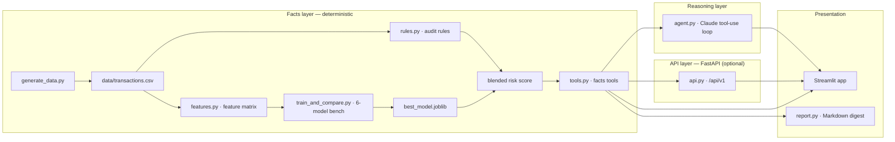

# FinSight Agent — Autonomous Personal Finance Analyst

> Turns raw bank transactions into fraud alerts, spending insight, and plain-English advice — autonomously.

[](https://www.python.org/downloads/)
[](LICENSE)
[](https://github.com/themanoj-025/FinSight-Agent/actions/workflows/ci.yml)
[](#model-benchmark)

---

## Table of Contents

- [1. Executive Summary](#1-executive-summary)
- [2. Tech Stack & Core Technologies](#2-tech-stack--core-technologies)
- [3. High-Level Architecture](#3-high-level-architecture)
- [4. Complete Folder Structure Tree](#4-complete-folder-structure-tree)
- [5. Exhaustive File-by-File & Folder-by-Folder Breakdown](#5-exhaustive-file-by-file--folder-by-folder-breakdown)
- [6. Data Models & Schemas](#6-data-models--schemas)
- [7. API Surface](#7-api-surface)
- [8. Configuration & Environment Variables](#8-configuration--environment-variables)
- [9. Build, Run & Deployment Instructions](#9-build-run--deployment-instructions)
- [10. Data & Control Flow Walkthroughs](#10-data--control-flow-walkthroughs)
- [11. Dependency Graph Summary](#11-dependency-graph-summary)
- [12. Testing Strategy](#12-testing-strategy)
- [13. Known Issues, Technical Debt & Assumptions](#13-known-issues-technical-debt--assumptions)
- [14. Glossary](#14-glossary)
- [15. Appendix](#15-appendix)

---

## 1. Executive Summary

**FinSight Agent** is an end-to-end, agentic personal-finance system that generates a realistic synthetic transaction ledger, benchmarks six fraud-detection models, auto-selects the best one by PR-AUC, and wraps everything in a hybrid agent (rules + ML + LLM) you can question in plain English.

**Target users**: Data scientists, ML engineers, fintech developers, and anyone building fraud detection or personal finance applications.

**What problem it solves**: Fraud detection is complex — simple accuracy metrics are misleading with rare positive classes (~1-2% fraud rate). FinSight provides honest evaluation (PR-AUC-first, temporal splits, leakage-free features), a hybrid scoring system (rules + ML + anomaly detection), and an LLM-powered conversational interface that explains every finding.

**Why it exists**: Most fraud detection tutorials stop at "train a model, print accuracy." FinSight goes deeper: honest benchmarking, per-transaction SHAP explanations, a hybrid scoring blend, and a conversational agent that only speaks from tool outputs — never fabricated numbers.

*Note: The model benchmark numbers, architecture decisions, and evaluation methodology are explicitly documented in README.md and config.yaml. The target user profile is inferred from the feature set.*

---

## 2. Tech Stack & Core Technologies

| Layer | Technology | Version | Purpose |
|-------|-----------|---------|---------|
| Language | Python | 3.10+ | Primary language |
| ML Framework | scikit-learn | ≥1.4,<1.9 | Model training, evaluation, preprocessing |
| Gradient Boosting | LightGBM | ≥4.0,<5 | Primary fraud detection model (selected for SHAP) |
| Similar-case retrieval | FAISS (optional) | ≥1.7,<2 | Similar-transaction retrieval; exact numpy fallback when `faiss-cpu` is absent (see `finance_agent/retrieval.py`) |
| Web UI | Streamlit | ≥1.47,<1.62 | Interactive dashboard (8 pages) |
| API Framework | FastAPI | ≥0.110,<1 | Versioned facts API (`/api/v1`) |
| LLM Agent | Anthropic Claude | ≥0.25,<1 | Optional conversational interface |
| Database | SQLite | — | Transaction persistence + materialized risk scores |
| Configuration | PyYAML | ≥6.0,<7 | Centralized config (`config.yaml`) |
| Testing | pytest | ≥8.0,<9 | Unit + integration tests |
| Linting | ruff | ≥0.4,<0.17 | Code quality |
| Type Checking | mypy | ≥1.8,<3 | Static type analysis |
| CI/CD | GitHub Actions | — | CI (9 jobs), nightly benchmark, weekly retrain |

> **Planned, not implemented:** earlier drafts listed **MLflow** (experiment
> tracking) and **Optuna** (hyperparameter optimization) as core technologies.
> They are **not** part of this codebase today — no code imports them and no
> dependency ships them. See `docs/KNOWN_LIMITATIONS.md` §20. Similar-transaction
> retrieval, by contrast, **is** implemented (`finance_agent/retrieval.py`,
> optional `faiss-cpu` with an exact-L2 numpy fallback).
>
> Guardrail: `scripts/check_docs_consistency.py` now fails if any technology in
> this table is not imported by code under `finance_agent/` or `model_bench/`,
> listed in `pyproject.toml`, or on the explicit platform/stdlib allowlist — so
> a phantom technology can never return to this table silently.

---

## 3. High-Level Architecture



**Architectural Pattern**: **Strict Layered Architecture** with enforced separation:
- **Facts layer** (deterministic): data generation, audit rules, feature engineering, model training — never reasons
- **Reasoning layer**: LLM tool-use loop — never computes numbers
- **Presentation layer**: Streamlit app — never touches data directly

---

## 4. Complete Folder Structure Tree

```
finsight-agent/
├── .dockerignore
├── .gitattributes
├── .githooks/
│   └── pre-push                    # Lockfile drift gate
├── .github/
│   ├── dependabot.yml
│   ├── ISSUE_TEMPLATE/
│   │   ├── bug_report.md
│   │   ├── config.yml
│   │   └── feature_request.md
│   ├── PULL_REQUEST_TEMPLATE.md
│   └── workflows/
│       ├── ci.yml                  # Main CI pipeline
│       ├── digest.yml              # Weekly digest job
│       └── retrain.yml             # Weekly auto-retrain
├── .gitignore
├── .streamlit/
│   └── config.toml                 # Streamlit config
├── app/                            # Streamlit presentation layer
│   ├── Home.py                     # Landing page
│   ├── api_client.py               # HTTP client (service mode)
│   ├── common.py                   # Auth, data source, shared helpers
│   └── pages/
│       ├── 1_Dashboard.py          # KPI cards, trends, callouts
│       ├── 2_Transactions.py       # Full ledger with filters
│       ├── 3_Fraud_Detection.py    # Model comparison + risk scan + SHAP
│       ├── 4_Ask_The_Agent.py      # Streaming chat
│       ├── 5_Reports.py            # Monthly digest + PDF
│       └── 6_Settings.py           # API key, regeneration, cost dashboard
├── CHANGELOG.md
├── CODE_OF_CONDUCT.md
├── config.yaml                     # Central configuration
├── CONTRIBUTING.md
├── docker-compose.yml
├── docker-entrypoint.sh            # Bootstrap data + model
├── Dockerfile
├── docs/
│   ├── architecture.md
│   ├── DataGeneration.md
│   ├── KNOWN_LIMITATIONS.md
│   ├── migration/
│   │   └── migration_summary.md
│   ├── design/
│   │   ├── AppFlow.md
│   │   └── Design.md
│   ├── product/
│   │   └── PRD.md
│   ├── project/
│   │   ├── analysis_report.md
│   │   ├── ImplementationPlan.md
│   │   ├── RiskRegister.md
│   │   ├── Rules.md
│   │   └── Tracker.md
│   ├── reference/
│   │   └── Glossary.md
│   └── technical/
│       ├── API.md
│       ├── Deployment.md
│       ├── Schema.md
│       ├── SecurityAndCompliance.md
│       ├── TechSpec.md
│       └── Testing.md
├── finance_agent/                  # Facts + reasoning layers
│   ├── __init__.py
│   ├── __main__.py                 # `python -m finance_agent` entry
│   ├── agent.py                    # Claude tool-use loop + offline narrator
│   ├── api.py                      # Versioned FastAPI facts API
│   ├── cli.py                      # `finsight` CLI entry point
│   ├── config_schema.py            # config.yaml validation
│   ├── constants.py                # Shared constants
│   ├── datagen.py                  # Vectorized synthetic data generator
│   ├── digest.py                   # Weekly digest (Slack/email)
│   ├── features.py                 # Backward-looking feature matrix
│   ├── fraud_patterns.py           # 15 difficulty-graded fraud archetypes
│   ├── merchants.py                # Merchant catalog, regions, seasonality
│   ├── personas.py                 # Persona archetype population model
│   ├── pdf_export.py               # Branded PDF writer (stdlib-only)
│   ├── report.py                   # Monthly Markdown report
│   ├── rules.py                    # Audit-rule detectors + financial health
│   ├── storage.py                  # SQLite persistence + materialized risk
│   └── tools.py                    # Facts tools (agent + API + CLI)
├── generate_data.py                # CLI over datagen.py
├── LICENSE
├── Makefile                        # 20+ convenience targets
├── model_bench/                    # 6-model benchmark
│   ├── __init__.py
│   ├── best_model_metadata.json    # Honest CV results (tracked)
│   ├── evaluate.py                 # Metrics + charts
│   ├── models.py                   # Model registry
│   ├── SEED_COUNTER
│   └── train_and_compare.py        # Temporal split + 5-fold time-series CV
├── pyproject.toml                  # Packaging + tooling config
├── README.md
├── requirements.lock               # Exact pinned dependencies
├── SECURITY.md
└── tests/                          # pytest suite
    ├── conftest.py
    ├── test_agent.py
    ├── test_api.py
    ├── test_api_client.py
    ├── test_app_smoke.py
    ├── test_config.py
    ├── test_data_realism.py
    ├── test_digest.py
    ├── test_evaluate.py
    ├── test_features.py
    ├── test_fraud_patterns.py
    ├── test_generate_data.py
    ├── test_merchants.py
    ├── test_models.py
    ├── test_pdf_export.py
    ├── test_rules.py
    ├── test_storage.py
    └── test_tools.py
```

---

## 5. Exhaustive File-by-File & Folder-by-Folder Breakdown

### `finsight-agent/finance_agent/` — Facts + Reasoning Layers

#### `finance_agent/datagen.py`
- **Purpose**: Vectorized synthetic transaction ledger generator with three tiers (tiny/demo/bench), 6 persona archetypes, multi-account structure, seasonality + drift, and 15 difficulty-graded fraud patterns.
- **Key exports**: `generate_ledger()`, tier configuration

#### `finance_agent/rules.py`
- **Purpose**: Hand-written audit-rule detectors (balance drains, duplicate charges, spend spikes) + financial health scoring. Pure, unit-tested, explainable, vectorized.

#### `finance_agent/features.py`
- **Purpose**: Strictly backward-looking feature matrix. No temporal leakage — a row's features only reference information available at or before that row's timestamp.

#### `finance_agent/fraud_patterns.py`
- **Purpose**: 15 difficulty-graded fraud/anomaly archetypes with per-archetype labels and discovery lag. Includes hard negatives.

#### `finance_agent/personas.py`
- **Purpose**: Persona archetype population model — generates realistic user behavior patterns for synthetic data generation.

#### `finance_agent/merchants.py`
- **Purpose**: Merchant catalog with regions, categories, and seasonality patterns.

#### `finance_agent/tools.py`
- **Purpose**: Facts tools that the agent, API, and CLI all call. Includes monthly summary, category breakdown, recurring payments, spikes, health score, forecast, blended risk scoring, and per-transaction SHAP explanations.

#### `finance_agent/agent.py`
- **Purpose**: Bounded Anthropic Claude tool-use loop with system-prompt guardrails + offline narrator fallback. Multi-turn history with per-session budget. Every figure in an answer traces to a tool call.

#### `finance_agent/api.py`
- **Purpose**: Versioned FastAPI facts API (`/api/v1`) with OpenAPI docs at `/docs`. Optional `X-API-Key` gate. `POST /api/v1/reload` for data refresh.

#### `finance_agent/storage.py`
- **Purpose**: Optional SQLite persistence (`data/transactions.db`). Materialized `risk_scores` table makes interactive risk scan a SQL point query.

#### `finance_agent/cli.py`
- **Purpose**: `finsight` CLI entry point supporting `ask`, `chat`, `report`, and `digest` commands.

#### `finance_agent/report.py`
- **Purpose**: Self-contained Markdown monthly report generator.

#### `finance_agent/pdf_export.py`
- **Purpose**: Branded PDF writer (hand-rolled, stdlib-only, zero new deps). A4 layout with navy brand band, styled tables, "Page X of Y" footer.

#### `finance_agent/digest.py`
- **Purpose**: Weekly digest builder + Slack/SMTP delivery (opt-in, stdlib-only).

---

### `finsight-agent/model_bench/` — Model Benchmark

#### `model_bench/models.py`
- **Purpose**: 6-model registry: Logistic Regression, Random Forest, LightGBM, SGD (linear SVM), Isolation Forest, MLP Autoencoder.

#### `model_bench/train_and_compare.py`
- **Purpose**: Temporal split + 5-fold time-series CV benchmark. Selects winner by PR-AUC with optional SHAP-explainability tie-break.

#### `model_bench/evaluate.py`
- **Purpose**: Metrics calculation + chart generation (ROC, PR curves, confusion matrices, feature importance, per-archetype recall, temporal stability, calibration).

#### `model_bench/best_model_metadata.json`
- **Purpose**: Tracked, reproducible results with mean ± std CV scores, per-archetype recall, and configuration provenance.

---

### `finsight-agent/app/` — Streamlit Presentation

| File | Purpose |
|------|---------|
| `app/Home.py` | Landing page with project overview and quickstart |
| `app/common.py` | Auth gate, data source selection, shared helpers |
| `app/api_client.py` | Stdlib-only HTTP client for service mode |
| `app/pages/1_Dashboard.py` | KPI cards, category donut, income/expense trend, budget progress |
| `app/pages/2_Transactions.py` | Full ledger with filters |
| `app/pages/3_Fraud_Detection.py` | Model comparison + live risk scan + SHAP explanations |
| `app/pages/4_Ask_The_Agent.py` | Streaming chat with activity log |
| `app/pages/5_Reports.py` | Monthly Markdown digest + branded PDF |
| `app/pages/6_Settings.py` | API key, data regeneration, cost/usage dashboard |

---

## 6. Data Models & Schemas

### Transaction Record

```json
{
  "step": "int — sequential timestamp",
  "user_id": "str — e.g., U_Alex",
  "account_type": "str — checking/savings/credit",
  "category": "str — groceries, dining, transport, etc.",
  "amount": "float — transaction amount",
  "merchant": "str — merchant name",
  "is_fraud": "bool — labeled fraud flag",
  "fraud_pattern": "str — e.g., balance_drain, slow_balance_drain",
  "balance_after": "float — account balance post-transaction"
}
```

### Risk Score (Materialized)

```json
{
  "transaction_id": "int — unique identifier",
  "rule_score": "float — 0-1 audit rule contribution",
  "supervised_prob": "float — 0-1 ML model probability",
  "iforest_score": "float — 0-1 anomaly detection score",
  "blended_risk": "float — weighted combination",
  "is_suspicious": "bool — above threshold"
}
```

### Model Metadata

```json
{
  "best_model": "LightGBM",
  "cv_pr_auc_mean": 0.828,
  "cv_pr_auc_std": 0.055,
  "cv_folds": 5,
  "per_archetype_recall": { ... },
  "dataset": { "rows": 10700000, "fraud_rate": "1.5%" }
}
```

---

## 7. API Surface

### Facts API (`/api/v1`)

| Method | Path | Purpose |
|--------|------|---------|
| `GET` | `/api/v1/monthly-summary` | Monthly spending/income summary |
| `GET` | `/api/v1/category-breakdown` | Spending by category |
| `GET` | `/api/v1/recurring-payments` | Detect recurring charges |
| `GET` | `/api/v1/spending-spikes` | Detect unusual spending |
| `GET` | `/api/v1/financial-health` | Overall health score |
| `GET` | `/api/v1/forecast` | Spending forecast |
| `POST` | `/api/v1/risk-scan` | Blended risk scoring |
| `POST` | `/api/v1/reload` | Refresh data + model |
| `GET` | `/docs` | OpenAPI/Swagger UI |

---

## 8. Configuration & Environment Variables

| Variable | Purpose | Default | Required |
|----------|---------|---------|----------|
| `ANTHROPIC_API_KEY` | Claude API key for LLM agent | — | No (offline narrator fallback) |
| `FINSIGHT_API_URL` | Facts API URL for service mode | — | No (in-process default) |
| `FINSIGHT_API_KEY` | API key for facts API | — | No |
| `FINSIGHT_RATE_LIMIT_PER_MIN` | Per-IP rate limit for `/api/*` (0 = off) | 0 | No (recommended in prod) |
| `FINSIGHT_CORS_ORIGINS` | CORS allow-list for the API (comma-separated) | `*` | No |
| `APP_PASSWORD` | Streamlit app password (per-session cooldown after 5 failures) | — | No (demo-grade) |
| `DIGEST_SLACK_WEBHOOK` | Slack webhook for weekly digest | — | No |
| `DIGEST_SMTP_PASSWORD` | SMTP password for email digest | — | No |

All tunable parameters live in `config.yaml`: data generation, model benchmark, risk scoring weights, budget goals, agent settings, and pricing.

---

## 9. Build, Run & Deployment Instructions

### Quick Start

```bash
git clone https://github.com/themanoj-025/FinSight-Agent
cd FinSight-Agent
make setup && make run
```

### Individual Steps

```bash
make data        # Generate synthetic ledger
make train       # Benchmark 6 models, select winner
make run         # Bootstrap everything + launch app
make api         # Run facts API (docs at :8000/docs)
make test        # Fast test suite
make lint        # ruff check + format
make typecheck   # mypy on finance_agent/ and model_bench/
```

### Docker

```bash
docker compose up    # App + facts API, zero setup
```

### CLI

```bash
finsight ask "Any suspicious activity?"
finsight chat
finsight report --pdf
finsight digest
```

---

## 10. Data & Control Flow Walkthroughs

### Flow 1: Ask the Agent a Question

1. User types question in Streamlit chat
2. `agent.py` receives question, selects tools via Claude
3. Tools execute: `rules.py`, `features.py`, model prediction
4. Results returned to Claude for narrative generation
5. Every number in the answer traces to a tool call (visible in activity log)
6. Response streamed to UI

### Flow 2: Risk Scan

1. User clicks "Scan for Risk" in Fraud Detection page
2. `tools.py:risk_scan()` loads transactions
3. For each transaction:
   - `rules.py` computes rule_score (balance drain, duplicate, spike)
   - Model predicts supervised_prob via LightGBM
   - Isolation Forest computes anomaly score
   - Blended: `w_rules*rule + w_model*ml + w_iforest*iforest`
4. Suspicious transactions displayed with SHAP explanations
5. User clicks any flagged transaction to see feature contributions

---

## 11. Dependency Graph Summary

```
finance_agent/datagen.py → personas.py, fraud_patterns.py, merchants.py
finance_agent/rules.py → (pure, no internal deps)
finance_agent/features.py → rules.py
finance_agent/tools.py → rules.py, features.py, model_bench/, storage.py
finance_agent/agent.py → tools.py, anthropic (optional)
finance_agent/api.py → tools.py, fastapi
finance_agent/cli.py → agent.py, report.py, digest.py
app/* → finance_agent/tools.py (or api_client.py in service mode)
model_bench/train_and_compare.py → features.py, models.py, evaluate.py
```

---

## 12. Testing Strategy

- **Framework**: pytest with `slow` marker for long-running tests
- **Fast suite**: `make test` (excludes `slow`-marked tests)
- **Slow suite**: `make test-slow` (full server boot + 100k-row perf)
- **CI**: lint → typecheck → fast tests → docs-code consistency → lockfile drift → pip-audit
- **Nightly**: full benchmark on demo/bench-tier data, data-realism suite with 60s wall-clock gate
- **Coverage gate**: Enforced in CI

---

## 13. Known Issues, Technical Debt & Assumptions

### Known Issues

1. **Synthetic data only**: v0.1 uses generated data; real bank transaction import not yet supported.
2. **LLM agent requires API key**: Without `ANTHROPIC_API_KEY`, uses deterministic offline narrator.
3. **App password is demo-grade**: `APP_PASSWORD` provides basic gating, not production auth.

### Technical Debt

1. **SQLite scaling**: Materialized risk scores work well for demo scale but may need PostgreSQL for production.
2. **Single-user by default**: Multi-user mode exists but requires configuration.

### Assumptions

1. **Python 3.10+**: Tested on 3.10 and 3.12.
2. **No data download needed**: Fully offline by default.
3. **LightGBM as default model**: Selected for SHAP explainability tie-break.

---

## 14. Glossary

| Term | Definition |
|------|-----------|
| **PR-AUC** | Precision-Recall Area Under Curve — preferred metric for rare positive classes |
| **SHAP** | SHapley Additive exPlanations — per-feature contribution to model prediction |
| **Temporal Split** | Train/test split by time (no shuffling) to prevent data leakage |
| **Time-Series CV** | Cross-validation respecting temporal ordering |
| **Blend Score** | Weighted combination of rules + ML + anomaly detection |
| **Offline Narrator** | Deterministic fallback when no LLM API key is available |
| **Materialized Risk Scores** | Pre-computed risk scores stored in SQLite for fast lookup |

---

## 15. Appendix

### Model Benchmark Results (Bench-Tier)

| Model | PR-AUC (mean ± std) | ROC-AUC | F1 |
|-------|---------------------|---------|-----|
| Logistic Regression | 0.536 ± 0.117 | 0.991 | 0.297 |
| Random Forest | 0.855 ± 0.057 | 0.994 | 0.608 |
| **LightGBM (selected)** | **0.828 ± 0.055** | **0.998** | **0.733** |
| SGD (linear SVM) | 0.164 ± 0.042 | 0.973 | 0.277 |
| Isolation Forest | 0.154 ± 0.081 | 0.962 | 0.090 |
| MLP Autoencoder | 0.287 ± 0.093 | 0.950 | 0.252 |

LightGBM is selected over Random Forest due to SHAP explainability preference (within 1 std of leader).

---

*This document was generated as part of a comprehensive project documentation effort. Last updated: August 8, 2026.*
