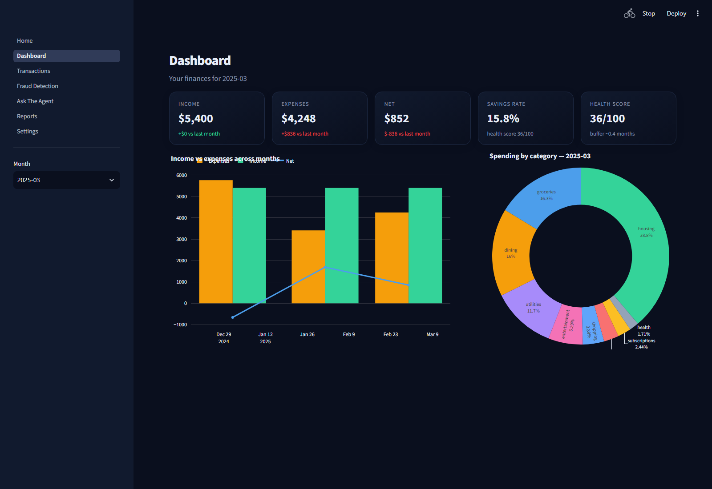
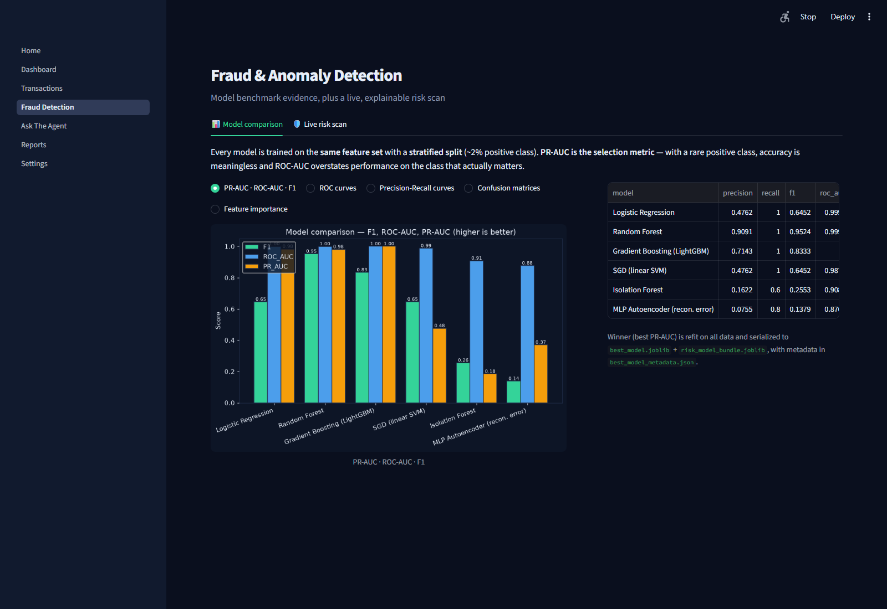
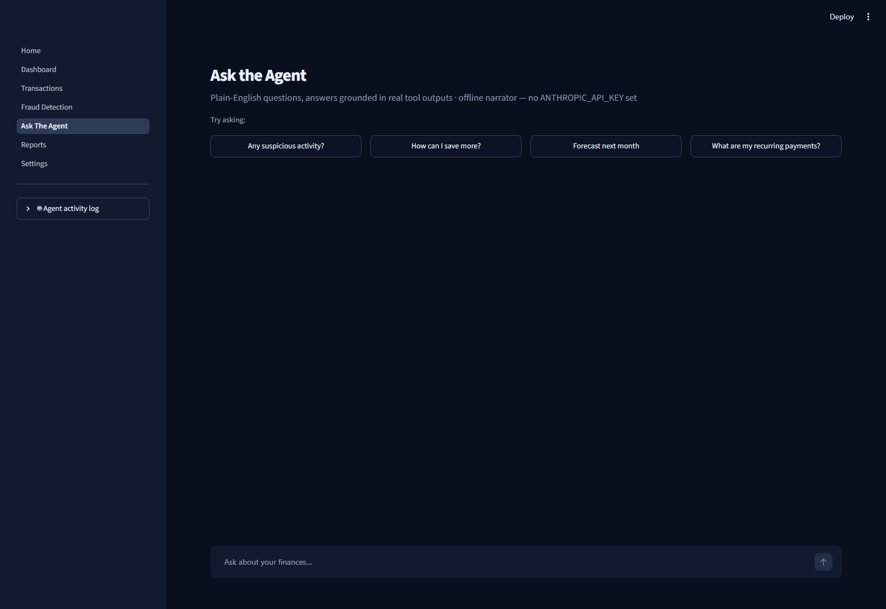
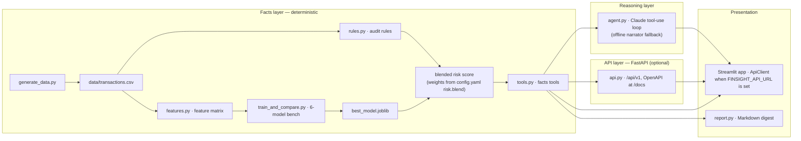

<div align="center">

# FinSight Agent

**Turns raw bank transactions into fraud alerts, spending insight, and plain-English advice — autonomously.**


[](https://github.com/themanoj-025/FinSight/actions/workflows/ci.yml)


*An end-to-end, agentic personal-finance system: deterministic synthetic data → feature engineering →
6-model benchmark with honest time-series CV → a hybrid **rules + ML + LLM** agent you can question
in plain English — all behind a polished Streamlit app.*

</div>

---

## 💡 Why I Built This

I built FinSight because I was frustrated with fraud detection tutorials that just print a meaningless accuracy score on a static dataset. I wanted to build a true end-to-end ML pipeline with honest time-series cross-validation, while exploring how to safely integrate LLMs into a deterministic rules engine without letting them hallucinate financial data.

## ⚠️ Known Limitations

- **FAISS Latency:** The similar-transaction retrieval uses a local FAISS index which rebuilds in-memory. This scales poorly past 1M rows and should be replaced with pgvector in a real deployment.
- **Synthetic Data Drift:** While the synthetic ledger generator has 15 fraud patterns, it's ultimately still synthetic. It won't capture the true adversarial drift seen in real-world credit card fraud.
- **Agent Token Usage:** Using Claude/Gemini to narrate every single flagged transaction can quickly rack up API costs. The offline deterministic fallback helps, but the LLM route isn't cost-effective for batch processing.

---

## ✨ Features

| | Capability |
|---|---|
| 🧾 | **Synthetic ledger generator** — deterministic and vectorized, with **three tiers** (`tiny` for CI, `demo` for the app, `bench` for the model benchmark up to millions of rows). Multi-persona population (6 archetypes), multi-account structure (checking/savings/credit), seasonality + annual raises + drift, a geography/merchant taxonomy, and a **15-pattern difficulty-graded fraud library** with per-archetype labels. Balances always chain correctly. |
| ⚖️ | **Hybrid risk scoring** — hand-written audit rules + a supervised model's probability + an isolation-forest anomaly score blend into one explainable risk score per transaction (`config.yaml risk.blend`). |
| 🧠 | **Agentic reasoning (optional)** — a bounded Anthropic Claude tool-use loop answers questions in plain English, **only from tool outputs, never from invented numbers**; an activity log proves every claim. |
| ⚡ | **Outbound risk-alert webhook (opt-in)** — flip `features.webhook_alerts` + set `alerts.webhook_url`, and a live risk scan that flags a transaction above the threshold POSTs a small JSON payload to your endpoint (Slack Incoming Webhook or any HTTP receiver); deduplicated per transaction so repeated scans never spam. |
| 📴 | **Offline narrator fallback** — no `ANTHROPIC_API_KEY`? The agent degrades to a deterministic narrator that answers the same questions. Zero credentials required. |
| 📊 | **Honest benchmarking** — 6 fraud-detection models compared by **mean PR-AUC over 5-fold time-series CV** (temporal split, strictly backward-looking features, no leakage). |
| 🕵️ | **Per-transaction explanations** — native LightGBM TreeSHAP shows exactly *why* any flagged transaction scored the way it did (contributions + bias = log-odds). |
| 🔎 | **Similar-transaction retrieval** — click any flagged transaction and see its nearest neighbours in feature space (FAISS `IndexFlatL2`, exact numpy fallback) with their fraud-archetype labels: “why is this flagged — what does it look like?” gets real, grounded comparison cases, agent tool + API + UI. |
| 🛡️ | **Trust & Transparency page** — model card, dataset card, per-archetype recall (including the honest adversarial-tier gap), cohort fairness, threat-model summary, and cost projection, all read live from the benchmark metadata so they can never drift. |
| 🌐 | **Versioned facts API** — the facts layer is exposed as FastAPI + OpenAPI (`/api/v1`), and the Streamlit app becomes a real client of it when `FINSIGHT_API_URL` is set. |
| 🗄️ | **SQLite persistence** — the ledger and a **materialized** `risk_scores` table live in `data/transactions.db`, making the interactive risk scan a SQL point query instead of a full re-score on every rerun. |
| 🎯 | **Budget goal tracker** — per-category monthly goals in `config.yaml`, tracked on the Dashboard with progress bars and over-goal callouts (`budget_status` tool + `/api/v1/budget-status`). |
| 👥 | **Multi-user mode** — `data.focal_users` generates a full balanced ledger per user; the sidebar switches which account the dashboard, chat, and reports view (`?user=` on the API). |
| 📅 | **Weekly digest** — a scheduled job (`make digest` / `digest.yml`) summarizes the last 7 days to Slack and/or email — opt-in, zero new dependencies. |
| 📝 | **Monthly report** — a self-contained Markdown digest, generated with one command. |
| 📄 | **Branded PDF export** — hand-rolled, stdlib-only PDF writer with A4 layout, navy brand band, styled tables, and "Page X of Y" footer (`finsight report --pdf`). |
| 📊 | **Cost/observability dashboard** — per-session token usage, estimated cost, and latency tracked in the Settings page, with config-driven model pricing. |
| 🔄 | **Weekly auto-retrain** — a CI workflow regenerates data + models on a schedule and opens a **PR for human review** (never force-pushes to `main`), with a canary per-archetype recall diff in every PR (Phase A.3). |
| 🚢 | **One-command + Docker** — `make run` does everything; `docker compose up` runs the app *and* the facts API with zero setup. |

### Why this is interesting

Most fraud-detection tutorials stop at "train a model, print an accuracy." This project goes three levels deeper:

1. **Hybrid rule + ML + LLM agent.** Hand-written audit rules (balance drains, duplicate charges, spend spikes) blend with a supervised model's probability and an isolation-forest anomaly score into one explainable risk score per transaction — and an LLM narrates it, **only from tool outputs, never from invented numbers**.
2. **Honest evaluation, PR-AUC-first.** With a rare positive class (≈1% or less at benchmark scale), accuracy is meaningless and ROC-AUC flatters the majority class. The benchmark uses a **temporal train/test split** (no shuffle), **strictly backward-looking features** (no leakage), and **5-fold time-series cross-validation** with mean ± std — plus **per-archetype recall**, **cohort fairness**, **temporal stability**, and **calibration** so the evidence shows *where* the model wins and loses instead of one aggregate number.
3. **Fully offline by default.** No `ANTHROPIC_API_KEY`? The agent degrades to a deterministic narrator that answers the same questions. Reviewers can run the entire demo with zero credentials.

Plus the engineering: config-driven, one-command bootstrap, tests, CI, a **weekly automated retrain workflow** that opens a PR instead of force-pushing, Docker, structured logging, and an agent activity log that proves tool use is real.

---

## 📸 Screenshots

_Dashboard — KPI cards, category donut, income/expense trend, auto-generated callouts_



_Fraud & Anomaly Detection — model comparison artifacts + live risk scan with per-transaction SHAP explanations_



_Ask the Agent — streaming chat grounded in tool outputs (offline narrator shown)_



---

## 🏗️ Architecture



The layers are strictly separated: **the facts layer never reasons, the reasoning layer never
computes numbers, and the UI never touches data directly.** The UI reaches the facts layer either
in-process (default, offline) or through the **versioned HTTP API** when `FINSIGHT_API_URL` is set —
the app is then a genuine client of it (see [Service mode](#service-mode-optional)). That separation
is what makes the system explainable and interview-defensible.

A deep dive lives in [`docs/technical/TechSpec.md`](docs/technical/TechSpec.md); the end-to-end
application flows are in [`docs/design/AppFlow.md`](docs/design/AppFlow.md).

---

## 🚀 Quickstart

```bash
git clone https://github.com/themanoj-025/FinSight
cd FinSight
make setup && make run
```

That's it — `make run` generates the data, trains and benchmarks the models, and launches the app at
http://localhost:8501. **No data download, no API key required.**

> **Requirements:** Python 3.10+ (tested on 3.10 and 3.12). The `llm` extra (`anthropic`) is optional.

| Alternative | Command |
|---|---|
| Individual steps | `make data` · `make train` |
| Everything (data + train) | `make all` |
| Docker (app **and** facts API) | `docker compose up` |
| Facts API | `make api` — docs at http://localhost:8000/docs |
| CLI agent | `finsight ask "Any suspicious activity?"` |
| CLI chat | `finsight chat` |
| Report | `finsight report` |
| Report PDF | `finsight report --pdf` (branded A4 PDF next to the Markdown) |
| Weekly digest | `finsight digest` (Slack/email opt-in) |
| Tests | `make test` · `make lint` · `make typecheck` · `make docs-check` |

### Service mode (optional)

The facts layer is also exposed as a **versioned HTTP API** (`finance_agent/api.py`,
FastAPI + OpenAPI). The Streamlit app becomes a client of it when `FINSIGHT_API_URL` is set
(`app/common.py::get_facts` returns an `ApiClient` that mirrors the facts interface, so pages are
unchanged):

```bash
make api          # terminal 1: facts API on :8000
FINSIGHT_API_URL=http://localhost:8000 streamlit run app/Home.py   # terminal 2
```

- `FINSIGHT_API_KEY` (optional) gates every `/api/*` request with an `X-API-Key` header.
- `FINSIGHT_RATE_LIMIT_PER_MIN` (optional) enables a per-IP sliding-window rate
  limit on `/api/*` (429 + `Retry-After`; off by default — set it in production).
- `FINSIGHT_CORS_ORIGINS` (optional) locks the API's CORS allow-list to your
  origins (comma-separated); unset = `*`, which is only safe because
  `allow_credentials` is always False.
- If the API is unreachable the app **falls back to local facts with a visible warning**.
- `docker compose up` wires this up for you: an `api` service (which bootstraps data + model on
  first start) and a `finsight` service pointed at it (`FINSIGHT_API_URL=http://api:8000`).

**Optional:** add an `ANTHROPIC_API_KEY` (in the app's Settings page, session-only) to switch from
the offline narrator to the real Claude tool-use agent. Set `APP_PASSWORD` to gate the app behind a
shared password (demo-grade — see [`docs/KNOWN_LIMITATIONS.md`](docs/KNOWN_LIMITATIONS.md)).

---

## 🖥️ Usage

### The app

The Streamlit app has **8 pages**:

| Page | What it does |
|---|---|
| 🏠 Home | Project intro, quickstart, architecture recap |
| 📈 Dashboard | KPI cards, category donut, income/expense trend, budget progress bars, auto-generated callouts |
| 🧾 Transactions | Full ledger with filters (focal only, category, date, amount) |
| 🚨 Fraud & Anomaly Detection | Model-comparison charts + live risk scan + per-transaction SHAP explanations |
| 💬 Ask the Agent | Streaming chat grounded in tool outputs, with a sidebar activity log |
| 📄 Reports | Self-contained Markdown monthly digest + branded PDF download |
| ⚙️ Settings | Session-only API key, data regeneration, service-mode status, cost/usage dashboard |
| 🛡️ Trust & Transparency | Model card, per-archetype recall, cohort fairness, threat model, cost projection — every number live from the benchmark metadata |

### The CLI

```bash
# One-shot question to the agent (narrator without a key, Claude tool-use with one)
finsight ask "Any suspicious activity this month?"

# Interactive chat
finsight chat

# Generate the monthly Markdown report
finsight report --out reports/monthly_report.md

# Build + deliver the weekly digest (file-only unless a channel is configured)
finsight digest

# The same commands work via python -m finance_agent
python -m finance_agent ask "Any suspicious activity?"
python -m finance_agent chat
python -m finance_agent report
python -m finance_agent digest
```

All `make` targets (`make help` lists them):

| Target | Description |
|---|---|
| `make setup` | Install the package with dev extras |
| `make data` | Generate the demo-tier synthetic ledger (`data/transactions.csv`) |
| `make data-tiny` | Tiny tier (fast tests / CI) |
| `make data-demo` | Demo tier (same as `make data`) |
| `make data-bench` | Bench tier → `data/transactions.parquet` (model benchmark) |
| `make train` | Benchmark 6 models, pick the winner by CV PR-AUC, write bundle + metadata |
| `make train-bench` / `make bench` | Train on the bench-tier Parquet ledger |
| `make hpo` | Optuna study over the LightGBM family (opt-in; writes `hpo_param_importance.png` + study db) |
| `make hpo-promote` | Adopt the tuned params for the next `make train` (requires the improvement gate) |
| `make run` | Bootstrap everything and launch the app |
| `make api` | Run the FastAPI facts service (docs at http://localhost:8000/docs) |
| `make digest` | Build + deliver the weekly digest (Slack/email when configured) |
| `make report` | Generate the monthly Markdown report + branded PDF |
| `make test` | Fast pytest suite (excludes `slow`-marked tests) |
| `make test-slow` | Slow suite: full server boot + 100k-row perf |
| `make lint` | `ruff check` + `ruff format --check` |
| `make typecheck` | mypy on the whole project (`finance_agent/` · `model_bench/` · `app/` · `tests/`) |
| `make docs-check` | Docs-vs-code consistency (schema, tests, security claims) |
| `make mutate` | Mutation-test `rules.py` + `features.py` (D.4; slow, opt-in) |
| `make contract-fuzz` | Schemathesis-fuzz the API against the committed OpenAPI contract (F.3) |
| `make loadtest` | Locust load test vs the SLOs — needs the API up first (F.5) |
| `make a11y` | axe-core accessibility + mobile render check over all pages (F.4) |
| `make generate-secrets` | Mint strong `APP_PASSWORD` / `FINSIGHT_API_KEY` / `FINSIGHT_BUNDLE_KEY` values (audit §1a) |
| `make verify-secrets` | Self-check a deployment's gates — 401 without the API key, 200 with it (audit §1a) |
| `make hooks` | Enable git hooks once per clone (pre-push lockfile check) |
| `make clean` | Remove generated artifacts (keeps tracked metadata) |

---

## 📁 Project structure

```text
finsight-agent/
├── app/                      # Streamlit app (8 pages)
│   ├── Home.py
│   ├── common.py             # auth gate, data source selection, shared helpers
│   ├── api_client.py         # stdlib-only HTTP client (service mode)
│   └── pages/                # 1_Dashboard … 7_Trust_Transparency
├── finance_agent/            # the facts + reasoning layers
│   ├── rules.py              # audit-rule detectors + financial-health score
│   ├── datagen.py            # vectorized generator engine (tiers, balances, assembly)
│   ├── personas.py           # persona archetype population model
│   ├── fraud_patterns.py     # 15-pattern difficulty-graded fraud/anomaly library
│   ├── merchants.py          # merchant catalog, regions, seasonality
│   ├── features.py           # strictly backward-looking feature matrix
│   ├── tools.py              # facts tools (agent + API + CLI call these)
│   ├── agent.py              # Claude tool-use loop + offline narrator
│   ├── api.py                # versioned FastAPI facts API (/api/v1, /metrics)
│   ├── retrieval.py          # similar-transaction retrieval (FAISS / numpy fallback, Phase B.1)
│   ├── bundle_security.py    # HMAC-SHA256 signing/verification of model bundles (C.2.4)
│   ├── storage.py            # optional SQLite persistence (materialized risk_scores)
│   ├── report.py             # self-contained Markdown monthly report
│   ├── digest.py             # weekly digest (Slack/SMTP, stdlib-only, opt-in)
│   ├── config_schema.py      # config.yaml validation at load time
│   └── cli.py                # `finsight` entry point (ask / chat / report / digest)
├── model_bench/              # 6-model registry + evaluation
│   ├── models.py             # model registry
│   ├── evaluate.py           # metrics + charts
│   ├── train_and_compare.py  # temporal split + 5-fold time-series CV benchmark
│   └── best_model_metadata.json   # honest mean ± std CV results (tracked)
├── docs/                     # the full documentation suite (see below)
├── tests/                    # pytest suite (fast + slow markers)
├── scripts/
│   ├── check_docs_consistency.py   # docs-vs-code gate
│   ├── check_lockfile.sh           # lockfile drift check (CI + pre-push hook)
│   ├── export_openapi.py           # freeze the API schema → docs/technical/openapi.v1.json (E.2)
│   ├── slo_check.py                # local SLO measurement (docs/technical/SLOs.md, D.2)
│   ├── contract_fuzz.py            # schemathesis fuzz of the API vs the committed contract (F.3)
│   ├── loadtest_check.py           # compare a Locust run against the documented SLOs (F.5)
│   └── accessibility_check.py      # Playwright + axe-core over all 8 pages (F.4)
├── loadtest/
│   └── locustfile.py               # Locust load-test definition for the cached-facts endpoints (F.5)
├── .github/
│   ├── workflows/            # ci.yml + retrain.yml
│   └── ISSUE_TEMPLATE/       # bug + feature templates
├── .githooks/pre-push        # lockfile-drift gate before every push
├── generate_data.py          # deterministic synthetic ledger generator
├── config.yaml               # every tunable lives here
├── pyproject.toml            # packaging + tooling config
└── requirements.lock         # exact pinned set (Python 3.10, uv-compiled)
```

---

## 🧪 What's inside

| Path | Purpose |
|---|---|
| `generate_data.py` | CLI + compatibility layer over `finance_agent/datagen.py`: three tiers (`--tier tiny|demo|bench`), persona ledgers (`data.focal_users`), multi-account rows, 15 fraud archetypes, CSV or Parquet output. `--days --seed --focal-users --n-background-accounts --start-date --format` |
| `finance_agent/datagen.py` | Vectorized generation engine — persona streams, clamped cumulative-sum balances, seed-sequence reproducibility, tier stats |
| `finance_agent/fraud_patterns.py` | 15 difficulty-graded fraud/anomaly archetypes + hard negatives, per-archetype labels + discovery lag |
| `finance_agent/rules.py` | Audit-rule detectors + financial-health score — pure, unit-tested, explainable, vectorized |
| `finance_agent/features.py` | Transaction features shared by training and inference — strictly backward-looking (no temporal leakage) |
| `finance_agent/config_schema.py` | Validates config.yaml at load time (`ConfigError` names the bad key) |
| `finance_agent/storage.py` | Optional SQLite persistence (`data.store_path`): `transactions` table + **materialized** `risk_scores`, hand-rolled migrations (`PRAGMA user_version`); makes the risk scan a SQL point query instead of recomputing on every rerun |
| `model_bench/` | 6-model registry, temporal split + 5-fold time-series CV, metrics + charts, serialized `best_model.joblib` + `risk_model_bundle.joblib` + metadata with mean ± std |
| `finance_agent/tools.py` | Facts tools: monthly summary, category breakdown, recurring payments, spikes, health, forecast, blended risk scoring (rule-only fallback renormalized), per-transaction SHAP explanations (`include_explanations=True`), and `find_similar_transactions` (Phase B.1) |
| `finance_agent/retrieval.py` | Similar-transaction retrieval — column-standardized, L2-normalized feature embeddings, FAISS `IndexFlatL2` with an exact numpy fallback (gated by `features.faiss_retrieval`) |
| `finance_agent/bundle_security.py` | HMAC-SHA256 signing (`<bundle>.sig`) + verification before `joblib.load` (C.2.4) |
| `finance_agent/api.py` | Versioned FastAPI facts API (`/api/v1`, OpenAPI at `/docs`, optional `X-API-Key` gate, pagination, Prometheus `/metrics`, `POST /api/v1/reload`) |
| `finance_agent/agent.py` | Bounded Anthropic tool-use loop with system-prompt guardrails + offline narrator + activity log; multi-turn history with a per-session budget |
| `app/api_client.py` | Stdlib-only HTTP client mirroring the facts interface — the app's data source in service mode |
| `finance_agent/report.py` | Self-contained Markdown monthly report |
| `finance_agent/pdf_export.py` | Branded PDF writer (hand-rolled, stdlib-only, zero new deps) |
| `finance_agent/digest.py` | Weekly digest builder + Slack/SMTP delivery (opt-in, stdlib-only); `make digest` |
| `app/` | Streamlit: Home, Dashboard, Transactions, Fraud & Anomaly Detection, Ask the Agent, Reports, Settings, Trust & Transparency |
| `.github/workflows/` | `ci.yml` (lint + typecheck + fast tests + nightly benchmark + mutation + contract-fuzz + load-test + data-realism), `retrain.yml` (weekly retrain via PR), `digest.yml` (weekly digest job), `accessibility.yml` (weekly axe-core pass), `status.yml` (uptime ping once deployed) |
| `config.yaml` | `agent.pricing` maps model IDs to per-token rates; `data.focal_users` selects multi-user mode |

---

## 📊 The model benchmark (evidence, not claims)

Metrics are **mean ± std over 5-fold time-series cross-validation** on the temporal train window,
with strictly backward-looking features. The holdout (last 20% of steps) is used only for final
scoring curves and the serialized winner.

```text
Model                           PR-AUC (mean ± std)   ROC-AUC (mean)     F1
Logistic Regression              0.536 ± 0.117          0.991            0.297
Random Forest                    0.855 ± 0.057          0.994            0.608
Gradient Boosting (LightGBM)     0.828 ± 0.055          0.998            0.733   ← selected
SGD (linear SVM)                 0.164 ± 0.042          0.973            0.277
Isolation Forest                 0.154 ± 0.081          0.962            0.090   (unsupervised baseline)
MLP Autoencoder (recon. error)   0.287 ± 0.093          0.950            0.252   (neural baseline)
```

> The numbers above are from the **committed bench-tier run** (`make bench`: a
> 10.7M-row, 4-year, 200-focal-persona ledger). The temporal train window is
> downsampled to `model_bench.max_train_rows` (600k rows, stratified by fraud
> class) so the 6-model CV stays practical; the **temporal test window is the
> full 2.7M-row holdout** — the holdout PR-AUC of the winner is 0.728. Both
> choices are recorded in `best_model_metadata.json` (`dataset`, `config`).
>
> **Per-archetype recall on that holdout is the interview-relevant view** — it
> shows *where* the model wins and loses instead of one aggregate number:
>
> | Archetype (difficulty) | Recall @ 0.5 | Support |
> | --- | ---: | ---: |
> | balance_drain (easy) | 1.000 | 153 |
> | slow_balance_drain (medium) | 1.000 | 402 |
> | subscription_creep (medium) | 1.000 | 192 |
> | account_takeover (hard) | 1.000 | 48 |
> | card_testing (medium) | 0.995 | 205 |
> | new_payee_transfer (medium) | 0.865 | 74 |
> | refund_abuse (medium) | 0.738 | 343 |
> | seasonal_mimicry (hard) | 0.475 | 80 |
> | mimicry (hard / adversarial) | 0.212 | 99 |
>
> "Catches the easy and medium tiers, struggles with the adversarial tier" —
> exactly the honest, expected shape. See
> `model_bench/results/per_archetype_recall.csv` for the full table.

> **Why is LightGBM selected?** The winner is chosen by CV PR-AUC with an
> **explainability tie-break** (see [config.yaml](config.yaml)
> `model_bench.shap_preference`): Random Forest leads CV PR-AUC (0.855 vs
> 0.828), but the Fraud page ships per-transaction SHAP explanations that only
> LightGBM provides natively (`pred_contrib`), and the difference is within 1
> CV standard deviation of the leader — statistically indistinguishable — so
> the explainable model is kept and the policy is recorded in
> `best_model_metadata.json`. Set `shap_preference: false` for a pure metric
> pick.

> **Hyperparameter optimization is real, not a claim** — `make hpo` runs an
> Optuna study over the LightGBM family's key hyperparameters (`num_leaves`,
> `learning_rate`, `min_child_samples`, `reg_alpha`, `reg_lambda`,
> `feature_fraction`) using the **same** mean-PR-AUC time-series CV objective,
> persisted to `model_bench/results/hpo_study.db` (browse with
> `optuna-dashboard`). The parameter-importance chart lands at
> `model_bench/results/hpo_param_importance.png`. Adoption is a documented
> human review: `make hpo-promote` lets the next `make train` use the tuned
> params only when the best trial beats the registry defaults by at least
> `model_bench.hpo.min_improvement` (0.01 PR-AUC, a CV-noise guard) — the
> study id, tuned params, and improvement are then recorded in
> `best_model_metadata.json` (`hpo_study_id`).

Charts (bar comparison with error bars, overlaid ROC, overlaid **Precision-Recall**, confusion-matrix
grid, feature importance, **per-archetype recall**, **temporal stability**, **calibration**, and
**HPO parameter importance** after `make hpo`) are
rendered in the app and saved to `model_bench/results/`. The winner is refit on all training data,
serialized, and consumed directly by the agent's blended risk score. The benchmark is re-runnable
end-to-end:

```bash
python model_bench/train_and_compare.py --data data/transactions.csv --config config.yaml       # tiny/demo CSV
python model_bench/train_and_compare.py --data data/transactions.parquet --config config.yaml     # bench Parquet
```

The tracked, reproducible result is machine-readable in
[`model_bench/best_model_metadata.json`](model_bench/best_model_metadata.json) — CV mean ± std plus
per-archetype recall, cohort fairness, temporal stability, and calibration.

### Evaluation methodology & limitations

Early versions of this benchmark computed velocity and category-mean features over the whole dataset
**before** a random stratified split, so test rows leaked information from training rows — producing a
PR-AUC of 1.000 that could not survive scrutiny. This was fixed in three ways, and the honest numbers
above are the result:

1. **Temporal split.** Rows are sorted by `step` and split at a fixed percentile (first 80% of steps
   train, last 20% test). No shuffling.
2. **Leakage-free features.** `build_features()` is strictly backward-looking — a row's features only
   ever reference information available at or before that row's `step` (trailing per-category means
   instead of full-frame means). Enforced by `tests/test_features.py::test_no_temporal_leakage`.
3. **Time-series cross-validation.** Model selection uses `TimeSeriesSplit(k=5)` on the train window
   and reports mean ± std, so `best_model_metadata.json` carries `cv_folds`/`pr_auc_mean`/`pr_auc_std`
   rather than a single point estimate.

The data is synthetic and the injected fraud patterns are deliberately rule-detectable, so absolute
numbers are illustrative — the point is the *method*. See
[`docs/KNOWN_LIMITATIONS.md`](docs/KNOWN_LIMITATIONS.md) for the full, plain-language list of what
this project does and does not do.

---

## 🤔 Design decisions (and the trade-offs)

- **PR-AUC over accuracy.** Accuracy is ~98% on this data before doing anything clever. PR-AUC
  measures how well the model ranks the rare positive class and how precise its alerts are at recall
  you'd actually ship.
- **Rules AND ML, not just ML.** Rules encode structural signatures (a transfer that drains an
  account, a cash-out right after) that generalize instantly and explain themselves; ML catches
  statistical deviations rules miss. Each is weak alone — the blend is the point. The blend weights
  live in `config.yaml` (`risk.blend`) and every prose description of them is interpolated from
  config, so the docs can never drift from the computation.
- **The LLM never sees raw rows.** The agent only receives structured tool outputs. This keeps it
  cheap, fast, privacy-preserving, and hallucination-resistant — every figure in an answer traces to
  a tool call (visible in the sidebar activity log).
- **Synthetic data.** PaySim-style generation with injected, labeled anomalies makes evaluation
  meaningful and the demo fully reproducible — no license issues, no 500 MB downloads.
- **Offline narrator fallback.** LLM tool-use is the headline, but a reviewer who won't supply an API
  key still gets a working, honest demo.
- **Per-transaction SHAP explanations.** In the Fraud & Anomaly Detection page, pick any flagged
  transaction and see exactly which features pushed the model's fraud probability up or down — native
  LightGBM TreeSHAP (`pred_contrib`), no extra dependency, and the numbers are exact (contributions +
  bias = the model's log-odds).

---

## ✅ Testing & code quality

```bash
make test        # fast suite (pytest -m "not slow"); slow suite: pytest -m slow
make lint        # ruff check + format check
make typecheck   # mypy on the whole project (finance_agent/ model_bench/ app/ tests/)
make docs-check  # docs-vs-code consistency gate
```

- Type hints throughout, ruff + black formatting, structured logging (no `print` in library code).
- Config, not hardcoding: model choice, blend weights, thresholds, and the Claude model string all
  live in `config.yaml`, validated at load time by `finance_agent/config_schema.py`.
- Tests cover rule edge cases, feature no-leakage guarantees, config validation, generator
  determinism + balance continuity, model prediction paths, agent routing/history/budget, and
  **real page rendering** via Streamlit's `AppTest` harness (not just import checks). 30+
  critical cases are catalogued in [`docs/technical/Testing.md`](docs/technical/Testing.md).
- **Data realism** is tested separately: `tests/test_data_realism.py` (marked `slow`) runs a
  demo-tier ledger and asserts balance invariants, seasonality, income drift, archetype coverage,
  fraud-rate bands, and that life events never get fraud labels. The nightly `data-realism` CI
  job also asserts demo-tier generation stays under its **60-second wall-clock budget** so a
  silently-slower generator can never ship.
- **CI** on every push: lint → typecheck → fast tests (with a coverage gate) → a docs-code
  consistency check (`make docs-check` — schema, tests, security claims) → a lockfile-drift job
  (recompiles `requirements.lock` and fails on any mismatch) → `pip-audit` on the committed lockfile;
  a nightly job runs the full benchmark on demo/bench-tier data, and a dedicated `data-realism`
  job times demo-tier generation against its **60s wall-clock budget** and runs the realism suite;
  a `bench` dispatch of the nightly benchmark additionally fails on **bench-generation (≤ 15 min)
  and bench-training (≤ 30 min) wall-clock regression gates** — a return of the O(n²)-scale
  generator bugs fails loudly instead of silently eating the job timeout; the weekly retrain opens
  a PR with refreshed artifacts and re-runs the realism suite as a gate.
- **Nightly / on-demand quality jobs** (schedule or `workflow_dispatch`, never on every push):
  **mutation testing** (D.4 — mutmut over `rules.py` + `features.py` with a documented kill-score
  regression floor; see [`docs/technical/MutationTesting.md`](docs/technical/MutationTesting.md)),
  **contract fuzzing** (F.3 — schemathesis fuzzes every endpoint against the committed OpenAPI
  schema, excluding the destructive `/reload`; `make contract-fuzz`), **load testing** (F.5 —
  Locust at 50 users compares the cached-facts endpoints' p95/error rate against
  [`docs/technical/SLOs.md`](docs/technical/SLOs.md) with a pass/fail readout; `make loadtest`),
  and **accessibility** (F.4 — Playwright + axe-core over all 8 pages, zero critical/serious
  violations, plus a 375px mobile-overflow check; `make a11y`).
- **Lockfile**: `requirements.lock` pins the exact resolved set for Python 3.10 (reproducible across
  the 3.10/3.12 CI matrix). Regenerate with `uv pip compile pyproject.toml -o requirements.lock
  --python-version 3.10`. Drift is caught before CI by a **pre-push git hook** (`make hooks` — same
  `scripts/check_lockfile.sh` the CI `lockfile` job runs).
- [`docs/KNOWN_LIMITATIONS.md`](docs/KNOWN_LIMITATIONS.md) proactively lists what is simplified or not
  production-grade.

---

## 📚 Documentation

The full documentation suite lives in [`docs/`](docs/) — a cross-linked set that describes
exactly what the code does (the docs-code consistency gate enforces it):

| Area | Documents |
|---|---|
| Product | [PRD](docs/product/PRD.md) · [Known Limitations](docs/KNOWN_LIMITATIONS.md) |
| Technical | [TechSpec](docs/technical/TechSpec.md) · [Schema](docs/technical/Schema.md) · [API](docs/technical/API.md) · [Deployment](docs/technical/Deployment.md) · [Security & Compliance](docs/technical/SecurityAndCompliance.md) · [Testing](docs/technical/Testing.md) |
| Design | [AppFlow](docs/design/AppFlow.md) · [Design System](docs/design/Design.md) |
| Project | [Implementation Plan](docs/project/ImplementationPlan.md) · [Tracker](docs/project/Tracker.md) · [Rules](docs/project/Rules.md) · [Risk Register](docs/project/RiskRegister.md) |
| Data | [DataGeneration](docs/DataGeneration.md) |
| Architecture | [Architecture](docs/architecture.md) · [Folder Structure](docs/folder_structure.md) · [Migration Summary](docs/migration/migration_summary.md) · [Analysis Report](docs/project/analysis_report.md) |
| Governance | [Model Card](model_bench/MODEL_CARD.md) (auto-generated) · [Dataset Sheet](docs/DATASHEET.md) · [SLOs](docs/technical/SLOs.md) · [Threat Model](docs/technical/SecurityAndCompliance.md) |
| Reference | [Glossary](docs/reference/Glossary.md) |

Changes are tracked in [CHANGELOG.md](CHANGELOG.md).

---

## ❓ FAQ & troubleshooting

**Do I need an API key?** No. Without `ANTHROPIC_API_KEY` the agent uses a deterministic offline
narrator that answers the same questions. The key only upgrades to the real Claude tool-use agent.

**Is the data real?** No. Everything runs on a deterministically generated synthetic ledger with
injected, labeled fraud — reproducible from the seed, no real PII, no downloads.

**Why is the PR-AUC not 1.0?** Because the benchmark is honest now: temporal split, leakage-free
features, and 5-fold time-series CV — and the fraud library is difficulty-graded, with adversarial
archetypes (mimicry, account takeover) that are *supposed* to be imperfectly caught. The old 1.000
came from a data leak plus trivially rule-detectable patterns, and is gone by design. Watch the CV
mean in `best_model_metadata.json` and the per-archetype recall table rather than any single number.

**How do I enable the LLM agent?** Open the app → Settings → paste an `ANTHROPIC_API_KEY`
(session-only, never persisted). The Settings page validates it before claiming "connected".

**How do I use my own data?** You can't yet — v0.1 is synthetic-only by design. See
[`docs/KNOWN_LIMITATIONS.md`](docs/KNOWN_LIMITATIONS.md).

**Why does the app show "DEMO MODE — NOT SECURED"?** `APP_PASSWORD` is not set. Set it to gate the
app behind a shared password (demo-grade only).

**How do I point the app at the facts API?** Set `FINSIGHT_API_URL` (e.g.
`http://localhost:8000`). The app becomes a client of the API and falls back to local facts with a
visible warning if it's unreachable.

| Symptom | Fix |
|---|---|
| `make run` fails: port already in use | Stop the other process, or run `streamlit run app/Home.py --server.port 8502` |
| "No data" / blank pages | `make data` |
| "Model missing" / rule-only badge | `make train` (or retrain via Settings) |
| API returns 503 | Run `make data && make train` first, then restart `make api` |
| `docker compose up` fails during `pip install` | Transient network timeouts happen — retry; buildkit caches completed layers |
| Pre-push hook "ignored because not executable" | `chmod +x .githooks/pre-push` (Windows Git Bash: `git update-index --chmod=+x .githooks/pre-push`) |
| Lockfile drift error on push | `uv pip compile pyproject.toml -o requirements.lock --python-version 3.10` and commit |

---

## 🛣️ Roadmap

- [x] Budget goal tracker with progress bars per category
- [x] Multi-user support (switch focal user in the sidebar)
- [x] Slack/email weekly digest via a scheduled job
- [x] Branded PDF export of the report
- [x] Cost/observability dashboard for the agent (per-session tokens/cost/latency)
- [x] Per-transaction explanations ("why was this flagged?") — SHAP in the Fraud page
- [x] FastAPI wrapper exposing the facts layer as a versioned OpenAPI API, with the Streamlit app as
      a client via `FINSIGHT_API_URL`
- [x] SQLite persistence layer — ledger + materialized risk scores in `data/transactions.db`,
      migrations via `PRAGMA user_version` (`finance_agent/storage.py`); resolves the CSV scaling
      ceiling
- [x] Data-scale & realism upgrade — three generation tiers (`tiny`/`demo`/`bench`), 6 persona
      archetypes, multi-account structure, seasonality + drift + life events, merchant/region
      taxonomy, a 15-pattern difficulty-graded fraud library with per-archetype labels, and
      per-archetype recall / cohort fairness / temporal stability / calibration in the benchmark
- [x] Similar-transaction retrieval (Phase B.1) — FAISS-indexed feature-space neighbours with
      fraud labels, wired into the agent tool list, the API, and the Fraud page
- [x] Trust & Transparency page (Phase C.3) — model card, per-archetype recall, cohort fairness,
      threat-model summary, and cost projection, all live from the benchmark metadata
- [x] Bundle signing (C.2.4) — HMAC-SHA256 verified before `joblib.load`; tampered bundles are refused
- [x] Golden-answer suite (F.1) + resilience suite (D.3) — figures in answers trace to tool outputs;
      every broken dependency degrades visibly and correctly

---

## 🤝 Contributing

Contributions are welcome — see [CONTRIBUTING.md](CONTRIBUTING.md) for ground rules (layering
discipline, docs-change-in-same-commit, test requirements, commit conventions) and
[`docs/project/Rules.md`](docs/project/Rules.md) for the enforced operating rules. The project's
security policy and vulnerability-reporting process are in [SECURITY.md](SECURITY.md).

---

## 📄 License

MIT — see [LICENSE](LICENSE).

---

## ⭐ Show Your Support

- ⭐ Star the repository if you found the honest-evaluation approach useful
- 🐛 Report issues via the [issue tracker](https://github.com/themanoj-025/FinSight/issues)
- 💬 Ask questions or suggest features — contributions are welcome

<div align="center">

*Built with Python, pandas, scikit-learn, LightGBM, Streamlit, FastAPI, and a healthy respect for honest evaluation.*

</div>
---

## ⭐ Star History

[](https://github.com/themanoj-025/FinSight)
[](https://github.com/themanoj-025/FinSight/graphs/contributors)

[](https://star-history.com/#FinSight&Date)
