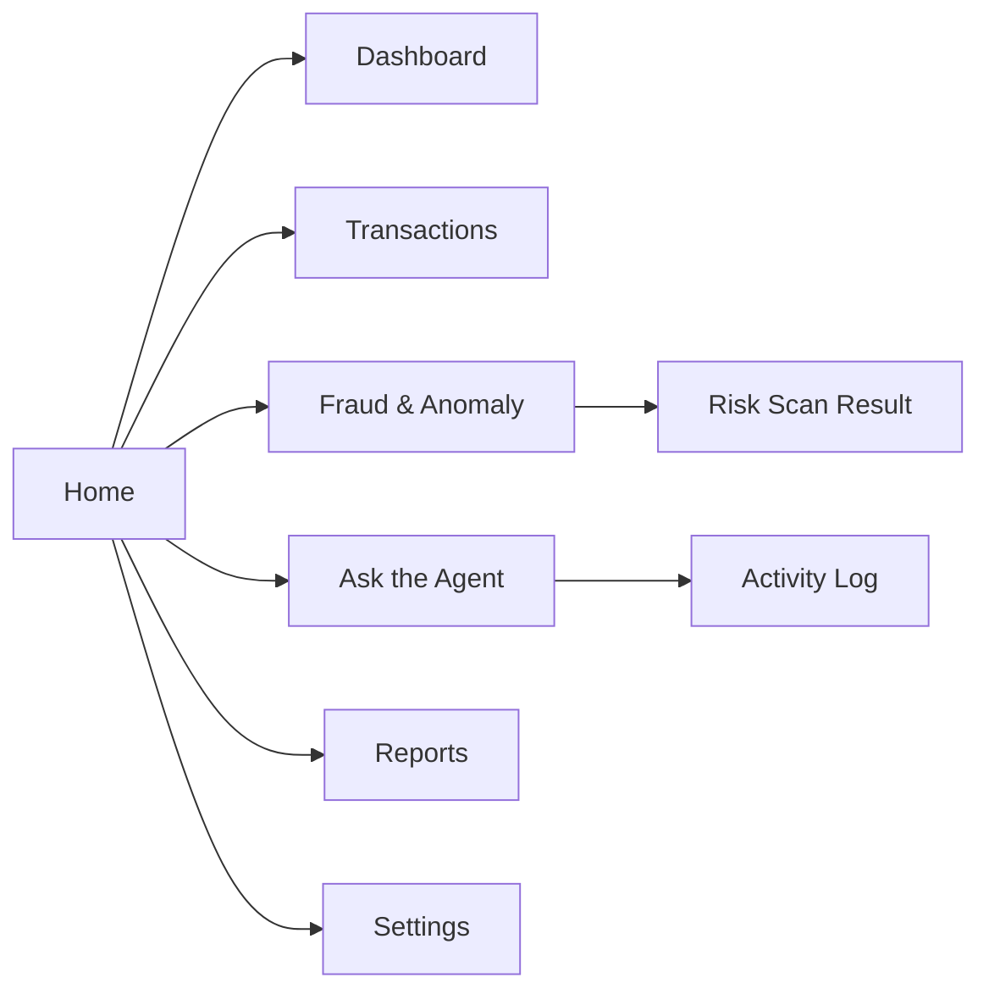
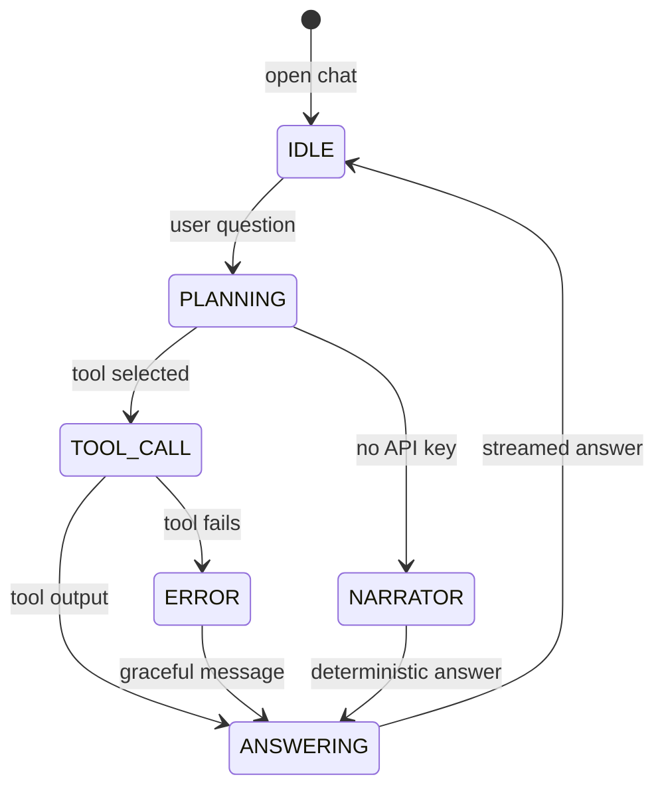
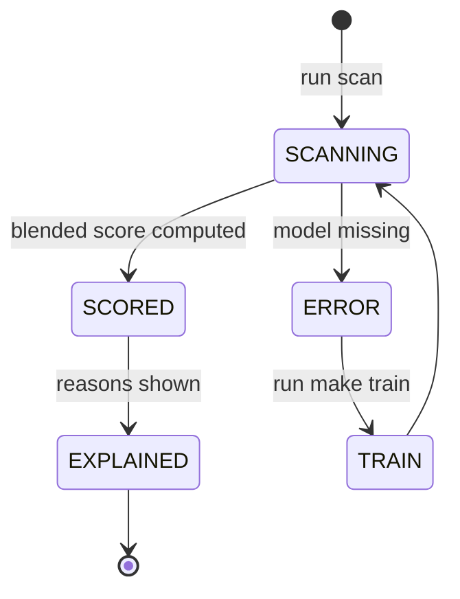

# AppFlow — FinSight Agent: Application Flow

| Field | Value |
| --- | --- |
| Version | v0.2 |
| Last Updated | 2026-08-07 |
| Owner | PM / QA |
| Status | Approved |

---

## 1. Screen Inventory

| SCR-### | Screen | Purpose | Entry | Exit | Auth |
| --- | --- | --- | --- | --- | --- |
| SCR-001 | Home | Intro + quickstart | app start | all pages | No |
| SCR-002 | Dashboard | KPI cards, donut, trends, callouts | nav | — | No |
| SCR-003 | Transactions | Ledger table + filters | nav | — | No |
| SCR-004 | Fraud & Anomaly | Model comparison + live risk scan | nav | case | No |
| SCR-005 | Ask the Agent | Streaming chat + activity log | nav | — | No |
| SCR-006 | Reports | Markdown digest + export | nav | — | No |
| SCR-007 | Settings | API key (session-only) | nav | — | No |

All screens render without login. The optional `APP_PASSWORD` env gate
(`app/common.py::require_auth`) applies to **every** page when set; when unset the app shows a
visible "DEMO MODE — NOT SECURED" banner.

## 2. Navigation Map

## 3. Detailed Flow per Journey

### Ask the agent

### Risk scan

## 4. Empty / Loading / Error States

| Screen | Empty | Loading | Error |
| --- | --- | --- | --- |
| Dashboard | "No data — run make data" | spinner | error banner |
| Fraud page | "No models — run make train" | — | model missing prompt |
| Chat | welcome | streaming indicator | fallback answer |
| Reports | "No report yet" | generating | — |

## 5. Edge Cases & Branching Logic

| IF condition | THEN route |
| --- | --- |
| No ANTHROPIC_API_KEY | Offline narrator |
| No model artifact | Prompt `make train` |
| No data | Prompt `make data` |
| Tool fails | Graceful error in answer |
| > 5 agent turns | Bound loop, summarize |

## 6. Notifications & Re-engagement

| Trigger | Channel | Destination |
| --- | --- | --- |
| Weekly retrain | CI artifacts | repo |
| Model PR-AUC moved | commit metadata | repo |

## 7. Cross-Platform Deltas

N/A — web app + CLI (`python -m finance_agent ask/chat/report`).

## 8. Related Documents

| Document | Relationship |
| --- | --- |
| [PRD.md](../product/PRD.md) | US-001…006 |
| [TechSpec.md](../technical/TechSpec.md) | Components |
| [Design.md](Design.md) | Screens |
| [Schema.md](../technical/Schema.md) | Data |
| [ImplementationPlan.md](../project/ImplementationPlan.md) | Tasks |
| [Tracker.md](../project/Tracker.md) | Status |
| [Rules.md](../project/Rules.md) | Standards |
| [API.md](../technical/API.md) | Tool contracts |
| [SecurityAndCompliance.md](../technical/SecurityAndCompliance.md) | Data |
| [Testing.md](../technical/Testing.md) | Tests |
| [Deployment.md](../technical/Deployment.md) | Env |
| [Glossary.md](../reference/Glossary.md) | Vocabulary |
| [RiskRegister.md](../project/RiskRegister.md) | Risks |
