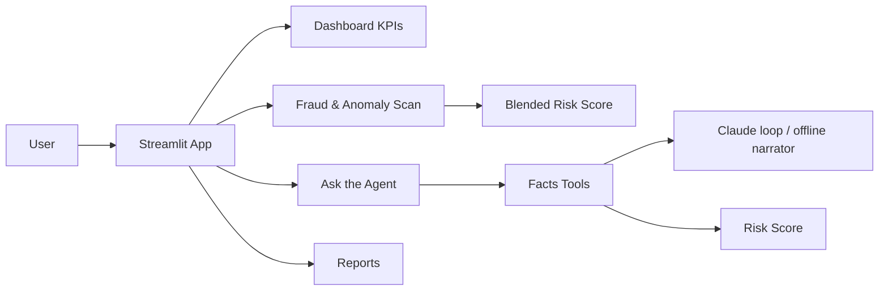

# PRD — FinSight Agent: Agentic Personal-Finance System

| Field | Value |
| --- | --- |
| Version | v0.2 |
| Last Updated | 2026-08-07 |
| Owner | Product Manager |
| Status | Approved |

---

## 1. Executive Summary

FinSight Agent turns raw bank transactions into fraud alerts, spending insight, and plain-English advice — autonomously. It generates a realistic synthetic transaction ledger, engineers features, benchmarks six fraud-detection models, auto-selects the best by PR-AUC, and wraps everything in a hybrid rules + ML + LLM agent that users question in plain English through a Streamlit app. The whole pipeline (data generation, training, benchmarking, retraining) runs with one command or on a weekly CI schedule, fully offline by default (LLM optional).

## 2. Problem Statement

- **User pain:** Fraud-detection tutorials stop at "train a model, print accuracy." Users want explainable answers about their money.
- **Evidence/context:** ~2% fraud rate makes accuracy meaningless; PR-AUC is the right metric. The blended risk score weights live in `config.yaml risk.blend` (defaults 0.4·rules + 0.3·model + 0.3·isolation forest; renormalized to rules-only when no model bundle is present).
- **Cost of not solving it:** Unexplained risk scores, missed anomalies, no path from raw data to trusted advice.

## 3. Goals & Non-Goals

| Goal | Metric | Target |
| --- | --- | --- |
| Explainable risk scoring | Every figure traces to a tool call | 100% |
| PR-AUC-first model selection | Selected model PR-AUC | ≥ 0.90 (synthetic, CV mean) |
| Fully offline by default | No API key needed | 100% of features work |
| One-command pipeline | `make run` | data→train→app |
| Weekly automated retrain | CI retrain workflow | runs weekly |

### Non-Goals (v1)
- Real bank/account integrations (synthetic data only).
- True multi-tenant isolation (multi-focal-user switching ships in v0.2; separate accounts, roles, and per-user auth do not).
- Regulatory audit-grade outputs.
- Production transactional serving.

## 4. Target Users & Personas

| Persona | Role | Goals | Frustrations | Quote | Tech Comfort |
| --- | --- | --- | --- | --- | --- |
| Sana — Personal Finance User | Understands spending | Plain-English insights | Opaque bank data | "Is anything suspicious?" | Low |
| Vikram — ML Portfolio Reviewer | Evaluates the system | Sound methodology | Accuracy inflation | "PR-AUC, not accuracy." | High |
| The Hiring Manager | Assesses engineering | Evidence, not claims | Hand-wavy demos | "Show me the tool log." | High |

## 5. User Stories

| ID | As a... | I want... | So that... | Priority | Acceptance Criteria |
| --- | --- | --- | --- | --- | --- |
| US-001 | User | ask about suspicious activity | I get answers | P0 | Chat answers from tool outputs |
| US-002 | User | monthly summary + category breakdown | I understand spending | P0 | Digest + charts |
| US-003 | User | fraud risk per transaction | I can review | P0 | Blended score + reasons |
| US-004 | Reviewer | benchmark of 6 models | I trust selection | P0 | PR-AUC table |
| US-005 | User | weekly auto-retrain | data stays fresh | P1 | CI weekly workflow |
| US-006 | User | Markdown report | I can export | P1 | Report file |

## 6. Feature List

| ID | Epic | Feature | Description | Priority | Status |
| --- | --- | --- | --- | --- | --- |
| REQ-001 | Data | Synthetic ledger generator | PaySim-style with labeled anomalies | P0 | Done |
| REQ-002 | Rules | Audit-rule detectors | Balance drains, duplicates, spikes | P0 | Done |
| REQ-003 | ML | Feature engineering | Shared train/infer features | P0 | Done |
| REQ-004 | ML | 6-model benchmark | PR-AUC auto-select | P0 | Done |
| REQ-005 | Risk | Blended risk score | weights from `config.yaml risk.blend`; rule-only renormalization when no bundle | P0 | Done |
| REQ-006 | Agent | Claude tool-use loop | 5-turn bounded + activity log | P1 | Done |
| REQ-007 | Agent | Offline narrator fallback | No-key deterministic answers | P0 | Done |
| REQ-008 | UI | Streamlit app (7 pages) | Dashboard, transactions, fraud, chat, reports | P0 | Done |
| REQ-009 | Report | Markdown monthly report | Self-contained digest | P1 | Done |
| REQ-010 | Ops | Weekly retrain workflow | Regenerate + re-benchmark | P1 | Done |
| REQ-011 | Explainability | Per-transaction SHAP explanations | Native LightGBM TreeSHAP (`pred_contrib`) in the Fraud page | P1 | Done |
| REQ-012 | API | Versioned FastAPI facts API | `/api/v1` + OpenAPI; app as a client via `FINSIGHT_API_URL` | P1 | Done |
| REQ-013 | Persistence | SQLite persistence layer | Materialized `risk_scores`; migrations via `PRAGMA user_version` | P1 | Done |

## 7. User Journeys (high level)

## 8. Success Metrics / KPIs

| Metric | Target | Measurement |
| --- | --- | --- |
| North Star: answers grounded in tool calls | 100% | Activity log |
| PR-AUC of selected model | ≥ 0.90 (synthetic, CV mean; SHAP-preference tie-break may pick a lower-AUC but explainable model) | benchmark |
| Offline functionality | 100% no key | test |
| Pipeline time | < 10 min | CI |
| Test suite | fast suite green (excludes slow) + slow suite | pytest |

## 9. Assumptions & Dependencies

- Synthetic data is illustrative (method is the point).
- Anthropic API key optional.
- Docker available for compose mode.

## 10. Risks

Top 3 (full list in ../project/RiskRegister.md):
1. **LLM hallucination** — mitigated by "LLM never sees raw rows; answers only from tool outputs."
2. **Synthetic data ≠ real** — mitigated by honest labeling + methodology emphasis.
3. **Model selection flattery** — mitigated by PR-AUC-first + stratified split.

## 11. Release Criteria

- [ ] `make run` works end-to-end.
- [ ] Benchmark shows PR-AUC selection + charts.
- [ ] Chat answers (LLM and offline narrator) traceable to tools.
- [ ] Dashboard renders 7 pages.
- [ ] CI + weekly retrain workflows green.

## 12. Open Questions

| Question | Owner | Resolve by | Status |
| --- | --- | --- | --- |
| Branded PDF export of the report? | PM | Release 1.1 | ✅ Resolved — implemented in `finance_agent/pdf_export.py` (`finsight report --pdf`) |

## 13. Related Documents

| Document | Relationship |
| --- | --- |
| [TechSpec.md](../technical/TechSpec.md) | Architecture, stack |
| [AppFlow.md](../design/AppFlow.md) | Screen flows |
| [Design.md](../design/Design.md) | Design system |
| [Schema.md](../technical/Schema.md) | Data model |
| [ImplementationPlan.md](../project/ImplementationPlan.md) | Build plan |
| [Tracker.md](../project/Tracker.md) | Task status |
| [Rules.md](../project/Rules.md) | Standards |
| [API.md](../technical/API.md) | Interfaces (agent tools) |
| [SecurityAndCompliance.md](../technical/SecurityAndCompliance.md) | Data handling |
| [Testing.md](../technical/Testing.md) | Test strategy |
| [Deployment.md](../technical/Deployment.md) | Deployment |
| [Glossary.md](../reference/Glossary.md) | Vocabulary |
| [RiskRegister.md](../project/RiskRegister.md) | Risks |
