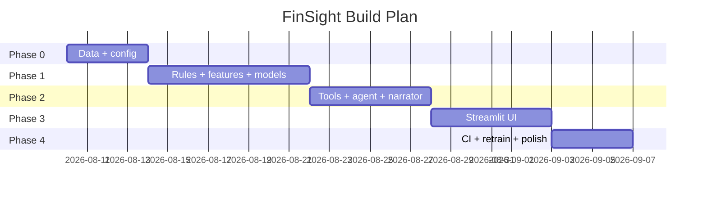
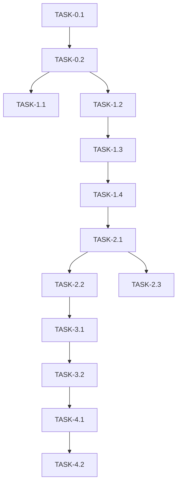

# ImplementationPlan — FinSight Agent: Phased Build Plan

| Field | Value |
| --- | --- |
| Version | v0.2 |
| Last Updated | 2026-08-07 |
| Owner | Engineering Lead |
| Status | Approved

---

## 1. Build Philosophy

Facts-first, offline-first: deterministic data + rules → models → tools → agent → UI. Reasoning layer added last, never allowed to invent numbers.

## 2. Phase Overview

## 3. Phase Breakdown

### Phase 0: Data
- Goal: seeded ledger generator.
- Exit: `make data` produces transactions.csv.

| TASK-# | Description | Depends on | Owner | Est. | Maps to |
| --- | --- | --- | --- | --- | --- |
| TASK-0.1 | config.yaml + scaffold | — | Eng | 1d | REQ-001 |
| TASK-0.2 | Synthetic ledger generator | TASK-0.1 | Data | 3d | REQ-001 |

### Phase 1: Facts
- Goal: rules + features + benchmark.
- Exit: best_model.joblib produced.

| TASK-# | Description | Depends on | Owner | Est. | Maps to |
| --- | --- | --- | --- | --- | --- |
| TASK-1.1 | Audit rules + health | TASK-0.2 | Eng | 2d | REQ-002 |
| TASK-1.2 | Feature engineering | TASK-0.2 | Data | 2d | REQ-003 |
| TASK-1.3 | 6-model benchmark + select | TASK-1.2 | ML | 4d | REQ-004 |
| TASK-1.4 | Blended risk score | TASK-1.3 | ML | 2d | REQ-005 |

### Phase 2: Agent
- Goal: tool-use loop + narrator.
- Exit: chat answers grounded in tools.

| TASK-# | Description | Depends on | Owner | Est. | Maps to |
| --- | --- | --- | --- | --- | --- |
| TASK-2.1 | Facts tools | TASK-1.4 | Eng | 2d | REQ-006 |
| TASK-2.2 | Claude tool-use loop | TASK-2.1 | Eng | 3d | REQ-006 |
| TASK-2.3 | Offline narrator | TASK-2.1 | Eng | 2d | REQ-007 |

### Phase 3: UI
- Goal: 7-page Streamlit app.
- Exit: all pages render.

| TASK-# | Description | Depends on | Owner | Est. | Maps to |
| --- | --- | --- | --- | --- | --- |
| TASK-3.1 | Dashboard + transactions | TASK-2.2 | FE | 3d | REQ-008 |
| TASK-3.2 | Fraud scan + chat + reports | TASK-3.1 | FE | 3d | REQ-008, REQ-009 |

### Phase 4: Ops
- Goal: CI + weekly retrain.
- Exit: both workflows green.

| TASK-# | Description | Depends on | Owner | Est. | Maps to |
| --- | --- | --- | --- | --- | --- |
| TASK-4.1 | ci.yml (lint→type→tests→pipeline) | TASK-3.2 | DevOps | 2d | REQ-010 |
| TASK-4.2 | retrain.yml weekly | TASK-4.1 | DevOps | 2d | REQ-010 |

## 4. Dependency Graph

## 5. Post-plan additions (shipped in v0.1)

The phases above (0–4) are all complete. After the original plan was closed out, three
enhancements shipped in v0.1 (tracked as tasks in Tracker.md):

| TASK | Description | Status | Maps to |
| --- | --- | --- | --- |
| TASK-5.1 | Per-transaction SHAP explanations (LightGBM TreeSHAP) in the Fraud page | 🟢 | REQ-011 |
| TASK-5.2 | Versioned FastAPI facts API (`/api/v1`) with the app as a client | 🟢 | REQ-012 |
| TASK-5.3 | SQLite persistence layer (`transactions` + materialized `risk_scores`) | 🟢 | REQ-013 |

## 6. Environment & Tooling Setup Checklist

- [ ] `make setup`
- [ ] `make data` (or within make run)
- [ ] `make train`
- [ ] `make run` → http://localhost:8501
- [ ] Optional: ANTHROPIC_API_KEY in Settings

## 7. Rollout Strategy

- Single-command app; Docker compose alt.
- Weekly retrain via CI (no prod deployment).
- Rollback: revert artifact commits.

## 8. Definition of Done (global)

- [ ] Tests pass
- [ ] Docs updated (this suite)
- [ ] Reviewed
- [ ] No secrets
- [ ] Tool answers grounded (activity log)

## 9. Related Documents

| Document | Relationship |
| --- | --- |
| [PRD.md](../product/PRD.md) | REQ mapping |
| [TechSpec.md](../technical/TechSpec.md) | Components |
| [AppFlow.md](../design/AppFlow.md) | Flows |
| [Schema.md](../technical/Schema.md) | Data |
| [Design.md](../design/Design.md) | UI tasks |
| [Tracker.md](Tracker.md) | Status |
| [Rules.md](Rules.md) | Standards |
| [API.md](../technical/API.md) | Tool contracts |
| [SecurityAndCompliance.md](../technical/SecurityAndCompliance.md) | Security |
| [Testing.md](../technical/Testing.md) | Tests |
| [Deployment.md](../technical/Deployment.md) | CI/CD |
| [Glossary.md](../reference/Glossary.md) | Vocabulary |
| [RiskRegister.md](RiskRegister.md) | Risks |
