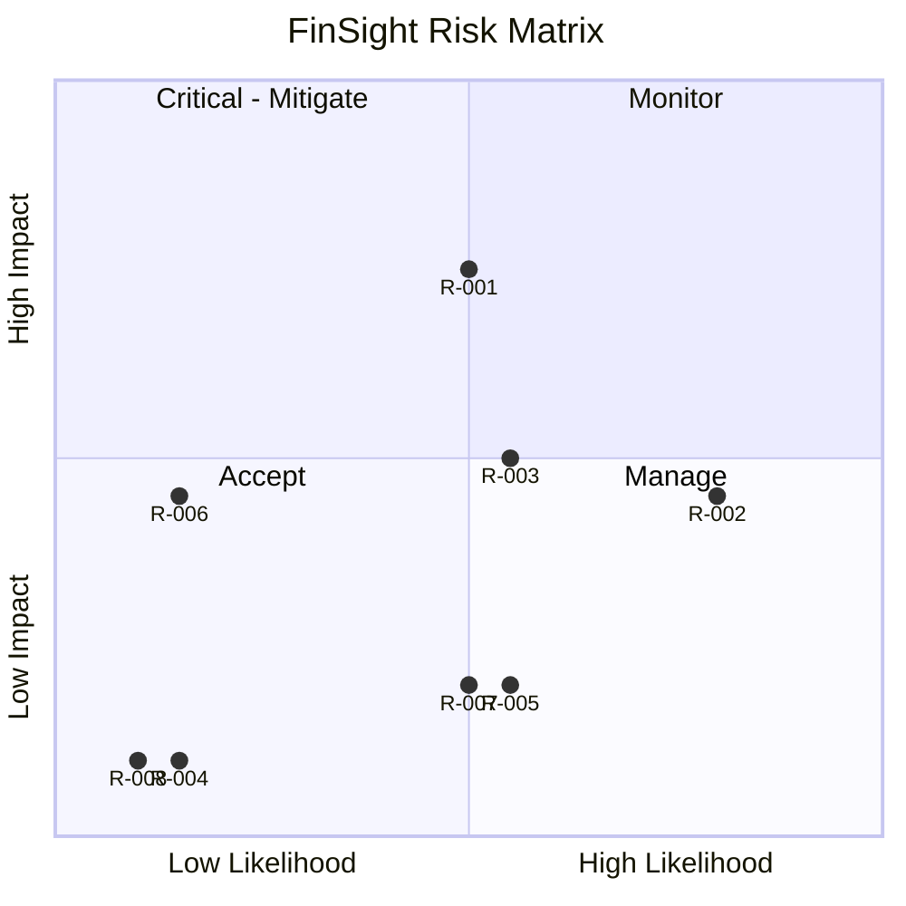

# RiskRegister — FinSight Agent: Known Risks

| Field | Value |
| --- | --- |
| Version | v0.2 |
| Last Updated | 2026-08-07 |
| Owner | PM / Eng Lead |
| Status | Approved |

---

| Risk | Likelihood | Impact | Score | Mitigation | Owner | Status |
| --- | --- | --- | --- | --- | --- | --- |
| R-001 LLM hallucination | Medium | High | 6 | Tool-output-only answers + activity log | Eng | Mitigating |
| R-002 Synthetic data ≠ real | High | Medium | 4 | Honest labeling + methodology | PM | Accepted |
| R-003 Accuracy inflation | Medium | Medium | 4 | PR-AUC + stratified split | ML | Mitigating |
| R-004 LLM cost/abuse | Low | Low | 1 | 5-turn bound; offline default | Eng | Mitigating |
| R-005 Weekly retrain degradation | Medium | Low | 2 | PR-based gate: benchmark diff review before merge; revert on regression | DevOps | Mitigating |
| R-006 API key session leak | Low | Medium | 3 | Session-only, never persisted | Security | Mitigating |
| R-007 Model artifact drift | Medium | Low | 2 | Versioned artifacts + metadata; lockfile + docs consistency gates in CI | ML | Mitigating |
| R-008 Non-reproducible runs | Low | Low | 1 | Seeded generator | Data | Mitigating |

## Risk Matrix

## Related Documents

| Document | Relationship |
| --- | --- |
| [PRD.md](../product/PRD.md) | Top-3 risks |
| [SecurityAndCompliance.md](../technical/SecurityAndCompliance.md) | R-006 |
| [TechSpec.md](../technical/TechSpec.md) | R-001/003 |
| [AppFlow.md](../design/AppFlow.md) | Flows |
| [Design.md](../design/Design.md) | Design |
| [Schema.md](../technical/Schema.md) | Data |
| [ImplementationPlan.md](ImplementationPlan.md) | Mitigations |
| [Tracker.md](Tracker.md) | Status |
| [Rules.md](Rules.md) | Standards |
| [API.md](../technical/API.md) | Tool contracts |
| [Testing.md](../technical/Testing.md) | Test coverage |
| [Deployment.md](../technical/Deployment.md) | Rollback |
| [Glossary.md](../reference/Glossary.md) | Vocabulary |
