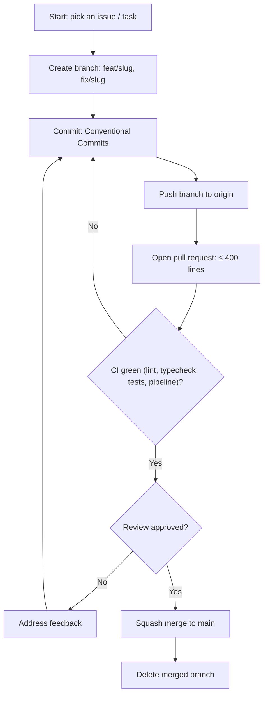

# Rules — FinSight Agent: Coding Standards & AI-Agent Operating Rules

| Field | Value |
| --- | --- |
| Version | v0.2 |
| Last Updated | 2026-08-07 |
| Owner | Engineering Lead |
| Status | Approved |

---

## 1. Guiding Principles

1. Facts never reason; reasoning never computes; UI never touches data.
2. Every number in an answer traces to a tool call.
3. PR-AUC over accuracy.
4. Offline by default — never require an API key.
5. Reproducible with seeds.
6. Small PRs only.
7. No silent failures — structured logging, no print in library code.

## 2. Code Style

- Python 3.10+, type hints required.
- Formatter: black; linter: ruff; typecheck: mypy.
- Structure:

```
generate_data.py
config.yaml
finance_agent/
  rules.py
  features.py
  tools.py
  agent.py
  report.py
  config_schema.py
  constants.py
model_bench/
  train_and_compare.py
  models.py
  evaluate.py
app/                 # Streamlit pages
tests/
.github/workflows/   # ci.yml, retrain.yml
```

## 3. Git Workflow

- Branches: `feat/<slug>`, `fix/<slug>`.
- Commits: Conventional Commits.
- PRs: ≤ 400 lines; CI green (lint → typecheck → tests → pipeline).
- Merge: squash to main.

## 4. Testing Requirements

- Fast suite: `pytest -m "not slow"` (target < 30s); slow suite: `pytest -m slow`.
- MUST have tests for: rule edge cases, feature no-leakage, tool output shapes,
  config validation, generator determinism + balance continuity, agent
  routing/history/budget, and real page rendering via AppTest.
- Docs changes MUST pass `make docs-check` (docs-vs-code consistency gate) before merging.
- See [Testing.md](../technical/Testing.md).

## 5. AI Agent Operating Rules

- Always read Tracker.md and ImplementationPlan.md before starting.
- Never mark a task 🟢 Done without tests passing.
- Never invent requirements not in ../product/PRD.md/../technical/TechSpec.md — flag ambiguity.
- Never let the LLM compute numbers — tool outputs only.
- Never commit secrets; env vars / session-only settings.
- State conflicts rather than silently picking one.

## 6. Security Baseline Rules

- No PII beyond synthetic data.
- API key session-only (never persisted).
- Input validation on config.
- Dependency scans weekly.

## 7. Documentation Rules

- New tools → ../technical/API.md same PR.
- New features → ../technical/Schema.md same PR.
- New config → ../technical/Deployment.md.

## 8. Prohibited Patterns

| Anti-pattern | Why |
| --- | --- |
| LLM computing financial numbers | Hallucination |
| print() in library code | Logging discipline |
| Accuracy-based selection | Misleading |
| Hardcoded thresholds | Config-driven by design |
| Persisting API keys | Leak |

## 9. Escalation Rules

**Ask a human when:** model selection changes, real data sources, LLM provider changes.
**Decide autonomously:** refactors, tests, config tuning.

## Git / PR Workflow



## 10. Related Documents

| Document | Relationship |
| --- | --- |
| [Testing.md](../technical/Testing.md) | Test requirements |
| [SecurityAndCompliance.md](../technical/SecurityAndCompliance.md) | Security |
| [PRD.md](../product/PRD.md) | Requirements |
| [TechSpec.md](../technical/TechSpec.md) | Architecture |
| [AppFlow.md](../design/AppFlow.md) | Flows |
| [Design.md](../design/Design.md) | Design |
| [Schema.md](../technical/Schema.md) | Data |
| [ImplementationPlan.md](ImplementationPlan.md) | Tasks |
| [Tracker.md](Tracker.md) | Status |
| [API.md](../technical/API.md) | Tool contracts |
| [Deployment.md](../technical/Deployment.md) | Env vars |
| [Glossary.md](../reference/Glossary.md) | Vocabulary |
| [RiskRegister.md](RiskRegister.md) | Risks |
