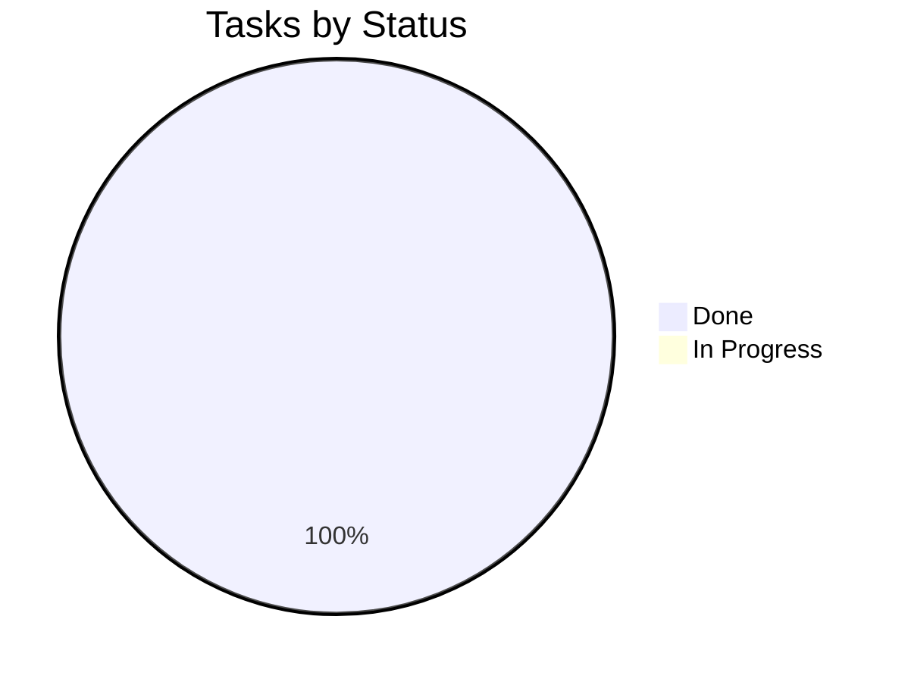

# Tracker — FinSight Agent: Living Status Tracker

| Field | Value |
| --- | --- |
| Version | v0.3 |
| Last Updated | 2026-08-07 |
| Owner | Engineering Lead |
| Status | Approved |

---

## 1. Snapshot Dashboard

| Metric | Value |
| --- | --- |
| Overall % Complete | 100% |
| Current Phase | All phases complete |
| Tasks Done / Total | 16 / 16 |
| Blockers (open) | 0 |
| Days to Target Launch | 0 (v0.1.0 shipped) |

## 2. Status Legend

🟢 Done | 🟡 In Progress | 🔴 Blocked | ⚪ Not Started | 🔵 In Review

## 3. Phase Progress Bars

| Phase | Progress |
| --- | --- |
| Phase 0: Data | `[████████░░] 100%` |
| Phase 1: Facts | `[████████░░] 100%` |
| Phase 2: Agent | `[████████░░] 100%` |
| Phase 3: UI | `[████████░░] 100%` |
| Phase 4: Ops | `[████████░░] 100%` |
| Post-plan (v0.1): SHAP / API / SQLite | `[████████░░] 100%` |
| Stretch (v0.2): budgets / multi-user / digest | `[████████░░] 100%` |
| Stretch (v0.3): PDF export / cost dashboard | `[████████░░] 100%` |

## 4. Full Task Table

| TASK | Description | Status | Assignee | Start | Target | Actual | Notes |
| --- | --- | --- | --- | --- | --- | --- | --- |
| TASK-0.1 | config + scaffold | 🟢 | Eng | 2026-07-01 | 2026-07-02 | — |  |
| TASK-0.2 | Ledger generator | 🟢 | Data | 2026-07-03 | 2026-07-06 | — |  |
| TASK-1.1 | Audit rules | 🟢 | Eng | 2026-07-07 | 2026-07-09 | — |  |
| TASK-1.2 | Features | 🟢 | Data | 2026-07-09 | 2026-07-11 | — |  |
| TASK-1.3 | 6-model benchmark | 🟢 | ML | 2026-07-12 | 2026-07-17 | — | temporal split + 5-fold CV; LGBM CV PR-AUC 0.932 ± 0.137 (SHAP tie-break over RF 0.972) |
| TASK-1.4 | Blended risk | 🟢 | ML | 2026-07-17 | 2026-07-19 | — |  |
| TASK-2.1 | Facts tools | 🟢 | Eng | 2026-07-20 | 2026-07-22 | — |  |
| TASK-2.2 | Agent loop | 🟢 | Eng | 2026-07-22 | 2026-07-26 | — |  |
| TASK-2.3 | Offline narrator | 🟢 | Eng | 2026-07-26 | 2026-07-28 | — |  |
| TASK-3.1 | Dashboard + tx | 🟢 | FE | 2026-07-29 | 2026-08-02 | — |  |
| TASK-3.2 | Fraud + chat + reports | 🟢 | FE | 2026-08-02 | 2026-08-06 | — |  |
| TASK-4.1 | ci.yml | 🟢 | DevOps | 2026-08-06 | 2026-08-08 | — |  |
| TASK-4.2 | retrain.yml | 🟢 | DevOps | 2026-08-07 | 2026-08-07 | 2026-08-07 | PR-based flow, fixed seed counter, single gate |
| TASK-5.1 | SHAP per-transaction explanations | 🟢 | ML | 2026-08-07 | 2026-08-07 | 2026-08-07 | Post-plan (v0.1) — TreeSHAP in the Fraud page |
| TASK-5.2 | FastAPI facts API + app-as-client | 🟢 | Eng | 2026-08-07 | 2026-08-07 | 2026-08-07 | Post-plan (v0.1) — /api/v1 + ApiClient |
| TASK-5.3 | SQLite persistence layer | 🟢 | Eng | 2026-08-07 | 2026-08-07 | 2026-08-07 | Post-plan (v0.1) — materialized risk_scores |
| TASK-6.1 | Budget goal tracker | 🟢 | FE | 2026-08-07 | 2026-08-07 | 2026-08-07 | Stretch (v0.2) — config goals, `budget_status` tool, Dashboard progress bars |
| TASK-6.2 | Multi-user support | 🟢 | Eng | 2026-08-07 | 2026-08-07 | 2026-08-07 | Stretch (v0.2) — `data.focal_users`, sidebar switcher, `?user=` API param |
| TASK-6.3 | Weekly digest | 🟢 | DevOps | 2026-08-07 | 2026-08-07 | 2026-08-07 | Stretch (v0.2) — `digest.py`, `make digest`, scheduled digest.yml, Slack/SMTP opt-in |
| TASK-7.1 | Branded PDF export | 🟢 | Eng | 2026-08-07 | 2026-08-07 | 2026-08-07 | Stretch (v0.3) — hand-rolled stdlib PDF writer, `report --pdf`, Tests |
| TASK-7.2 | Cost/observability dashboard | 🟢 | Eng | 2026-08-07 | 2026-08-07 | 2026-08-07 | Stretch (v0.3) — per-session usage capture, Settings dashboard, config pricing |

## 5. Blockers Log

| ID | Description | Raised | Owner | Impact | Status |
| --- | --- | --- | --- | --- | --- |
| BLK-001 | None open | — | — | — | — |

## 6. Changelog

| Date | What shipped |
| --- | --- |
| 2026-08-06 | Docs suite v0.1 — 14-file suite consolidated into `docs/`, cross-linked navigation, quality gate passed |
| 2026-08-06 | UI complete (7 pages) |
| 2026-08-07 | Master remediation complete — see below |
| 2026-08-07 | **v0.1.0 tagged** — DoD gates verified end-to-end (fast <30s, slow suite, ruff/mypy, greps, `make docs-check`) |
| 2026-08-07 | SQLite persistence layer (Phase 6) — `transactions` + materialized `risk_scores`, hand-rolled migrations |
| 2026-08-07 | **README 10/10 + docs refresh** — full README rewrite (badges, TOC, features, structure tree, usage, FAQ, troubleshooting, docs index), corrected task counts, PRD feature list + open questions, Deployment env-var reference, API CLI surface, git hygiene (`.gitignore`, `.gitattributes`, CI hardening, dependabot, `CHANGELOG.md`) |
| 2026-08-07 | **Stretch (v0.2) — budgets + multi-user + digest** — see below |
| 2026-08-07 | **Stretch (v0.3) — PDF export + cost dashboard** — see below |

### Master remediation (phases 0–6)

Shipped across the `fix:`/`feat:`/`perf:`/`docs:` commit series: temporal split +
5-fold time-series CV with honest mean ± std metadata (no more 1.000); rule-only
risk renormalization; real multi-turn chat with capped history + per-session
budget; config validation (`ConfigError`); generator balance continuity + `--seed 0`;
vectorized rules; risk-scoring cache; explicit expense computation; specificity-
weighted narrator routing; AppTest page renders; auth gate + model allowlist + key
validation; Docker/CI hardening; lockfile + pip-audit; PR-based retrain; SHAP
per-transaction explanations; FastAPI facts API with the app as its client;
`docs/KNOWN_LIMITATIONS.md`.

Definition-of-done gates all pass: `pytest -m "not slow"` < 30s, full suite green,
ruff + mypy clean, dead-dependency and placeholder-text greps clean, metadata
shows CV mean ± std, rule-only mode still flags obvious fraud, two-turn chat uses
context, `APP_PASSWORD` gate active, docs match code.

### Stretch (v0.2) — budget tracker, multi-user, weekly digest

All three tracker priorities shipped one by one: **budget goal tracker**
(`budgets.monthly` config goals + `budget_status` tool + Dashboard progress bars
with over-goal callouts, API/agent/report parity); **multi-user support**
(`data.focal_users` generates per-user ledgers, `FinanceFacts(focal_user=…)`
selection, sidebar switcher across all pages, `?user=` API param with per-user
facts caches, SHAP-aware benchmark tie-break recorded in metadata); **weekly
digest** (`finance_agent/digest.py`, `make digest`, `digest.yml` scheduled
workflow, opt-in Slack/SMTP delivery with stdlib-only clients, graceful
file-only fallback). New TC-024…TC-029 in `docs/technical/Testing.md`.

### Stretch (v0.3) — branded PDF export + cost/observability dashboard

**Branded PDF export** (`finance_agent/pdf_export.py`): a hand-rolled,
stdlib-only A4 PDF writer with navy brand band, accent rules, styled tables,
and "Page X of Y" footer. Wired into the CLI (`finsight report --pdf`),
Makefile (`make report`), and the Reports page (download button). WinAnsi
sanitization maps emoji to text markers; deterministic output (same markdown →
identical bytes). New TC-030 in `docs/technical/Testing.md`.

**Cost/observability dashboard** (`finance_agent/agent.py` + `app/pages/6_Settings.py`):
per-session usage capture (input/output tokens from Anthropic API, narrator
estimates, latency, estimated cost from `agent.pricing` in `config.yaml`),
Settings page tab with KPIs (total turns, tokens, cost, avg latency),
per-call table, and reset button. Chat sidebar shows remaining budget +
est. cost. New TC-031…TC-032 in `docs/technical/Testing.md`.

## 7. Burndown Summary

## 8. Next 3 Priorities

1. Prompt-caching + model routing (cheap/fast model for lookups, configured model for synthesis).
2. Per-transaction SHAP explanations surfaced in the monthly report (PDF).
3. Historical cost dashboard (persist usage across sessions for trend analysis).

## 9. Related Documents

| Document | Relationship |
| --- | --- |
| [ImplementationPlan.md](ImplementationPlan.md) | Tasks |
| [PRD.md](../product/PRD.md) | Features |
| [TechSpec.md](../technical/TechSpec.md) | Components |
| [AppFlow.md](../design/AppFlow.md) | Flows |
| [Design.md](../design/Design.md) | Design |
| [Schema.md](../technical/Schema.md) | Data |
| [Rules.md](Rules.md) | Standards |
| [API.md](../technical/API.md) | Tool contracts |
| [SecurityAndCompliance.md](../technical/SecurityAndCompliance.md) | Security |
| [Testing.md](../technical/Testing.md) | Tests |
| [Deployment.md](../technical/Deployment.md) | CI/CD |
| [Glossary.md](../reference/Glossary.md) | Vocabulary |
| [RiskRegister.md](RiskRegister.md) | Risks |
