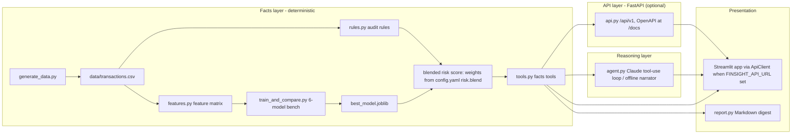
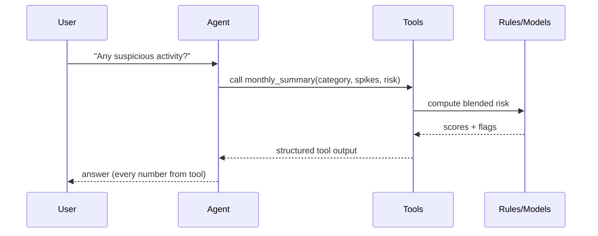
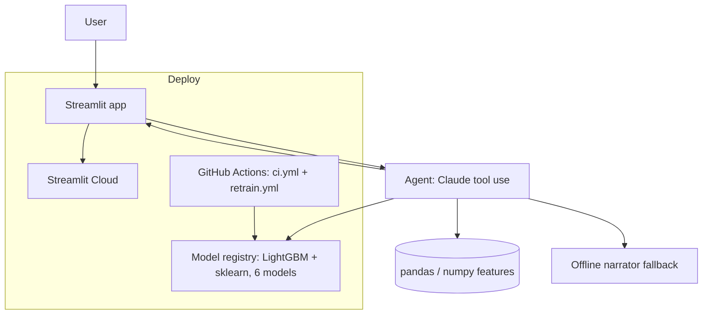
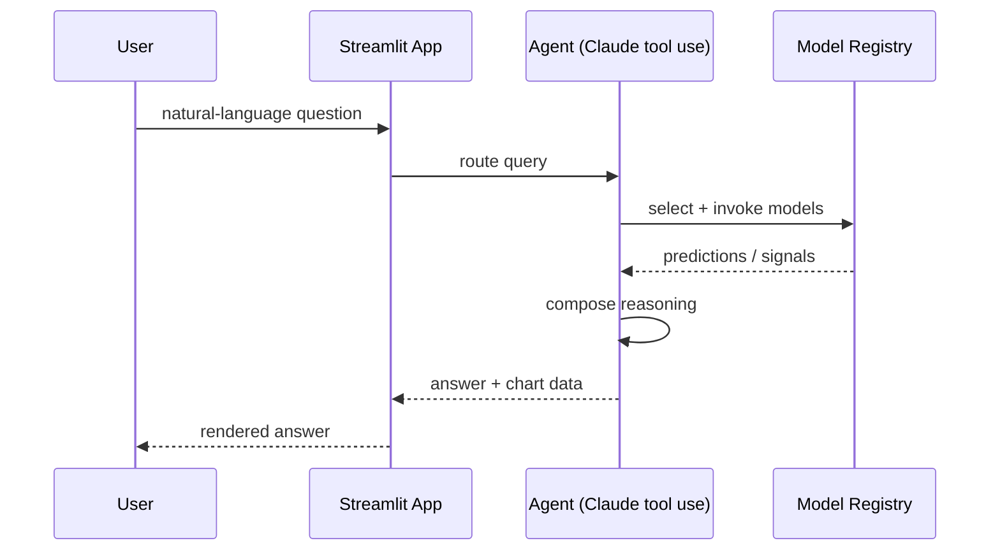

# TechSpec — FinSight Agent: Technical Specification

| Field | Value |
| --- | --- |
| Version | v0.2 |
| Last Updated | 2026-08-07 |
| Owner | Engineering Lead |
| Status | Approved |

---

## 1. Architecture Overview

**Layering rule:** facts layer never reasons; reasoning layer never computes; UI never touches data directly (in service mode it reaches facts only through the HTTP API).

## 2. Tech Stack Table

| Layer | Technology | Version | Justification |
| --- | --- | --- | --- |
| Language | Python | 3.10+ | ML + agent ecosystem |
| ML | scikit-learn, LightGBM | — | 6-model registry |
| Data | pandas, numpy | — | Feature engineering |
| Agent | Anthropic Claude (tool use) | — | Reasoning; offline narrator fallback |
| API | FastAPI + uvicorn | — | Versioned facts API (/api/v1), OpenAPI at /docs |
| UI | Streamlit | — | Polished data apps (ApiClient when FINSIGHT_API_URL set) |
| Config | YAML (config.yaml) | — | Model choice, weights, thresholds |
| Testing | pytest | 8.x | fast suite + AppTest renders + slow suite |
| Quality | ruff, black, mypy | — | lint + typecheck |
| CI | GitHub Actions | — | ci.yml + retrain.yml |
| Infra | Docker | — | compose mode |

## 3. System Components

| Component | Responsibility | Inputs → Outputs | Scaling | Failure Modes |
| --- | --- | --- | --- | --- |
| generate_data.py | Deterministic synthetic ledger | seed → transactions.csv | batch | none (deterministic) |
| rules.py | Audit-rule detectors + health | tx → rule flags | in-process | pure functions |
| features.py | Shared feature matrix | tx → features | in-process | missing columns |
| model_bench/ | 6-model compare + select | features → best_model.joblib | batch | small data |
| tools.py | Facts tools for agent | query → structured output | in-process | none |
| api.py | Versioned HTTP facts API | HTTP → structured output | per-process snapshot | stale after regen → reload endpoint |
| api_client.py | App's HTTP client | FINSIGHT_API_URL → facts interface | per-session cache | API down → local fallback |
| agent.py | Tool-use loop / narrator | question → answer | LLM quota | key missing → narrator |
| report.py | Markdown digest | tools → report | in-process | none |
| storage.py | Optional SQLite persistence | ledger + risk scores → data/transactions.db | single-writer | migrations via PRAGMA user_version |
| Streamlit app | 7 pages UI | API/tools → UI | per-session | app errors handled |

## 4. Data Flow Diagrams

## 5. Third-Party Integrations

| Service | Purpose | Failure Fallback | Cost Model | Rate Limits |
| --- | --- | --- | --- | --- |
| Anthropic Claude | Agent reasoning | Offline narrator (deterministic) | token | quota |

## 6. Non-Functional Requirements

| Category | Requirement | Target | How Verified |
| --- | --- | --- | --- |
| Performance | Pipeline runtime | < 10 min | CI timing |
| Availability | Offline default | works w/o key | tests |
| Explainability | Answer grounding | 100% tool-sourced | activity log |
| Determinism | Data generation | reproducible with seed | test |
| Observability | Agent activity log | all tool calls logged | UI sidebar |

## 7. Environments

| Env | Purpose | Data | Deploy |
| --- | --- | --- | --- |
| dev | local | synthetic | make run |
| CI | verify | synthetic | GitHub Actions |
| weekly retrain | refresh | new seed | retrain.yml |

## 8. Error Handling Strategy

- LLM call failure → narrator fallback (never blocks).
- Missing columns → explicit validation error.
- Config-driven thresholds in config.yaml.
- Structured logging, no print in library code.

## 9. Observability

- Agent activity log (sidebar) proving tool use.
- Structured logs; CI artifacts (benchmark charts + metadata).

## 10. Technical Risks & Mitigations

| Risk | Mitigation |
| --- | --- |
| LLM hallucination | Tool-output-only answers |
| Accuracy inflation | PR-AUC selection + stratified split |
| Non-reproducibility | Seeded generator |

## Deployment Topology

## Sequence: Ask-the-Agent Query

## 11. Related Documents

| Document | Relationship |
| --- | --- |
| [PRD.md](../product/PRD.md) | Requirements |
| [Schema.md](Schema.md) | Data model |
| [API.md](API.md) | Agent tool contracts |
| [AppFlow.md](../design/AppFlow.md) | Flows |
| [Design.md](../design/Design.md) | UI |
| [ImplementationPlan.md](../project/ImplementationPlan.md) | Phases |
| [Tracker.md](../project/Tracker.md) | Status |
| [Rules.md](../project/Rules.md) | Standards |
| [SecurityAndCompliance.md](SecurityAndCompliance.md) | Data |
| [Testing.md](Testing.md) | Tests |
| [Deployment.md](Deployment.md) | CI/CD |
| [Glossary.md](../reference/Glossary.md) | Vocabulary |
| [RiskRegister.md](../project/RiskRegister.md) | Risks |
