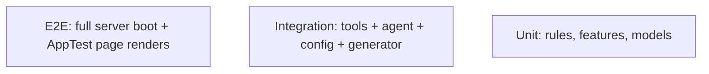

# Testing — FinSight Agent: Test Strategy

| Field | Value |
| --- | --- |
| Version | v0.2 |
| Last Updated | 2026-08-07 |
| Owner | QA Engineer |
| Status | Approved |

> This document lists only test cases that **actually exist** in `tests/`.
> The default `pytest` run excludes `slow`-marked tests (`-m "not slow"`);
> run the slow suite with `pytest -m slow` or `make test-slow`.

---

## 1. Test Pyramid

## 2. Strategy

| Layer | Tool | Scope |
| --- | --- | --- |
| Unit | pytest | Rule edge cases, feature shapes + no-leakage, model prediction paths, config validation |
| Integration | pytest | Tool output shapes, agent + narrator routing/history/budget, generator determinism + balance continuity |
| E2E (API) | pytest + uvicorn | Live FastAPI server (session fixture): endpoint shapes + ApiClient parity + app-renders-against-API |
| E2E | Streamlit AppTest | Real headless page rendering (7 pages) + full server boot (`slow`) |
| Data realism | pytest (`slow`, `data_realism`) | Demo-tier ledger properties: balance invariants, seasonality, income drift, life events, fraud-rate band, archetype coverage — runs in the nightly job, not on push |
| Pipeline | CI job | data → train → artifact check (nightly; also on push for the fast leg) |

Fast suite: `pytest -m "not slow"` — target **< 30 s**. Slow suite: `pytest -m slow`.

## 3. Critical Test Cases (all exist in tests/)

| ID | File | Case | What it guards |
| --- | --- | --- | --- |
| TC-001 | test_rules.py | Balance-drain edge (zero balance, window, healthy transfer) | Rule semantics, vectorized `merge_asof` rewrite |
| TC-002 | test_rules.py | Duplicate charge in/out of window, ignores transfers | Rule semantics |
| TC-003 | test_features.py | `test_no_temporal_leakage` | Row features unchanged when future rows removed (0.1) |
| TC-004 | test_features.py | Output shape/columns = 23 canonical features, no NaNs, stable dummies | Feature matrix contract (3.1) |
| TC-005 | test_models.py | `predict_scores` per branch (proba / IForest / autoencoder / decision_function) | Model registry (3.2) |
| TC-006 | test_evaluate.py | `compute_metrics` sane; permutation-importance path for non-tree winner | Evaluation (3.2) |
| TC-007 | test_config.py | Malformed config → `ConfigError` naming the bad key | Config validation (2.4) |
| TC-008 | test_generate_data.py | `--seed 0` respected; same seed → identical output | CLI falsy bug (2.1) + determinism (3.6) |
| TC-009 | test_generate_data.py | `test_ledger_balance_continuity` | Focal balance chain invariant (2.2) |
| TC-010 | test_generate_data.py | `subscription_total` tracks the source list | Magic-number drift (2.3) |
| TC-011 | test_tools.py | `test_rule_only_mode_can_still_flag_high_confidence_fraud` | Rule-only blend renormalization (0.2/3.5) |
| TC-012 | test_tools.py | `test_monthly_summary_excludes_cash_in_from_expenses` | Expense calc bug (2.10) |
| TC-013 | test_tools.py | Risk scoring recomputed once across thresholds | Caching (2.8) |
| TC-014 | test_agent.py | System prompt present in every API call; history included + capped | Guardrails + multi-turn (1.4/0.3/0.3b) |
| TC-015 | test_agent.py | Budget-exhausted fallback to narrator (N+1 refused) | Cost controls (1.3) |
| TC-016 | test_agent.py | Narrator routing table (12 phrasings incl. the two documented conflicts) | Routing (2.11) |
| TC-017 | test_agent.py | Narrator ignores injected instructions | Prompt-injection heuristic (1.4) |
| TC-018 | test_app_smoke.py | AppTest render, no exception, for all 7 pages | Real rendering (3.4 / 2.13 / 2.12) |
| TC-019 | test_app_smoke.py | Full server boot (`slow`) | E2E boot |
| TC-020 | test_tools.py | SHAP explanations attached with a bundle; identity sum(+bias) ≈ logit; off by default; empty in rule-only | Per-transaction SHAP (Phase 6) |
| TC-021 | test_api.py | HTTP endpoints against a live uvicorn server: health/meta/summaries/risk-scored/transactions shapes, 404, optional X-API-Key gate | FastAPI wrapper (Phase 6) |
| TC-022 | test_api_client.py | ApiClient parity with direct FinanceFacts (summaries, health, risk-scored with SHAP, `df` dtype round-trip) + unreachable-server error | App-as-client (Phase 6) |
| TC-023 | test_api_client.py | Settings page renders headlessly against a live API (`FINSIGHT_API_URL` set) | App-as-client wiring (Phase 6) |
| TC-024 | test_tools.py | `test_budget_status_reports_goals_and_over_flag` / `test_budget_status_tracks_an_over_goal_category` / `test_budget_status_unconfigured_is_graceful` | Budget tracker (stretch #1) |
| TC-025 | test_generate_data.py | `test_multiple_focal_users_each_get_full_balanced_ledgers` + `test_generator_emits_focal_cash_in` | Multi-user generator (stretch #2) |
| TC-026 | test_tools.py | `test_focal_user_selection_switches_monthly_summary` | Multi-user facts layer (stretch #2) |
| TC-027 | test_api.py / test_api_client.py | `test_budget_status_shape` / `test_meta_exposes_focal_users` / `test_user_param_switches_focal_user` / `test_client_focal_frame` | API multi-user + budget parity (stretch #1/#2) |
| TC-028 | test_agent.py | Narrator routing table includes `"Am I over budget on dining?" → budget` | Budget narrator branch (stretch #1) |
| TC-029 | test_digest.py | Digest sections, focal scoping, empty-data guard, Slack/email delivery, file-only fallback, CLI `digest` subcommand | Weekly digest (stretch #3) |
| TC-030 | test_pdf_export.py | PDF structural validity (xref offsets byte-correct, page/font objects present), WinAnsi sanitization, multi-page flow, `write_report_pdf` helper, CLI `report --pdf` wiring, determinism | Branded PDF export (stretch #4) |
| TC-031 | test_agent.py | Usage capture (input/output tokens, latency, estimated cost from config pricing), budget reset, narrator turns recorded, LLM budget-exhausted cost tracked | Cost/observability dashboard (stretch #5) |
| TC-032 | test_config.py | `agent.pricing` validation (non-negative, model key present), `data.focal_user ∈ focal_users` constraint | Config validation for pricing + multi-user |
| TC-033 | test_data_realism.py | `test_income_drifts_upward_over_years` | Annual raises compound year-over-year (Data-Gen §3) |
| TC-034 | test_data_realism.py | `test_life_events_do_not_trip_fraud_labels` | Life events are hard negatives, never fraud (Data-Gen §3/§5) |
| TC-035 | test_data_realism.py | `test_savings_balance_grows_monotonically` | Auto-transfer savings growth (Data-Gen §6) |
| TC-036 | test_generate_data.py | `test_seed_determinism_at_scale` | Seed determinism at demo scale (Data-Gen §9.4) |
| TC-037 | test_features.py | `test_out_of_home_region_flag` | Region signal semantics (Data-Gen §4) |
| TC-038 | test_features.py | `test_no_nans_with_negative_credit_balances` | Credit debt never produces NaN features (regression) |
| TC-039 | test_hpo.py | `test_run_hpo_writes_provenance_and_respects_adoption_gate` | Optuna HPO objective + adoption gate / provenance (A.1) |
| TC-040 | test_alerts.py | `test_risk_scan_posts_webhook_for_flagged_transactions` | Outbound risk-alert webhook: flag → POST payload, dedup, graceful failure (E.3) |
| TC-041 | test_canary.py | Deliberately-regressed mock bundle → `REGRESSION` end-to-end; tolerance boundary; no-baseline; feature-schema mismatch guard | Canary/shadow gate before auto-promote (A.3) |
| TC-042 | test_properties.py | Hypothesis: balance chain + non-negative balances + schema hold for any (seed, days, n_bg); fraud-rate band holds for meaningful pool sizes | Property-based generator invariants (F.2) |
| TC-043 | scripts/contract_fuzz.py (CI `contract-fuzz` job) | schemathesis fuzzes every operation in the committed `openapi.v1.json` against a live API (deterministic seed; `/reload` excluded); fails on 500s or schema-violating responses | Contract fuzzing (F.3) |
| TC-044 | scripts/accessibility_check.py (CI `accessibility` workflow) | Playwright + axe-core over all 8 pages: zero critical/serious violations; 375px mobile-overflow check on Dashboard + Transactions; no rendered exception boxes | Accessibility + mobile render (F.4) |
| TC-045 | loadtest/ + scripts/loadtest_check.py (CI `load-test` job) | Locust 50 users/120s on cached-facts endpoints after a warmup pass; p95 < 200 ms and 0% errors per endpoint vs SLOs.md, with every gated endpoint exercised | Load test vs SLOs (F.5) |

## 4. Test Data Strategy

- Seeded synthetic ledgers (deterministic); `generate_data.py` is the only data source.
- Hermetic `tmp_env` fixtures: small generated CSV + config in a temp dir, no shared state.
- AppTest render tests use the repo's `data/transactions.csv` (+ model bundle), generated once by a session fixture if missing.

## 5. CI Gates

- `make lint` (ruff check + format check)
- `make typecheck` (mypy on the whole project: `finance_agent/` + `model_bench/` + `app/` + `tests/`)
- `make test` (fast suite, `-m "not slow"`)
- `make test-slow` (server boot + 100k-row perf) — separate CI job
- Lockfile drift check: `uv pip compile pyproject.toml -o requirements.lock
  --python-version 3.10` is re-run and diffed against the committed lockfile;
  any drift fails the PR
- `pip-audit -r requirements.lock` + installability dry-run (security job)
- Nightly full benchmark job (data + train + artifact check)
- Nightly `data-realism` job — demo-tier generation **wall-clock gate (< 60s,
  Data-Gen §1)** plus the data-realism suite; a slow generator or a
  statistically broken dataset fails the night loudly
- Weekly retrain (retrain.yml) — opens a PR, never force-pushes; blocked by the data-realism gate; every PR carries a canary per-archetype recall diff (Phase A.3, `model_bench/canary.py`) and a regression beyond tolerance adds a `canary-regression` label
- Mutation testing (D.4) — `make mutate` runs mutmut over `rules.py` + `features.py`; a dedicated CI job re-runs it on the nightly schedule / on demand and fails loudly on error. Measured score is reported in [MutationTesting.md](MutationTesting.md)
- Contract fuzzing (F.3) — `scripts/contract_fuzz.py` (also `make contract-fuzz`) boots a throwaway API and fuzzes every operation in the committed OpenAPI schema with schemathesis; nightly/on-demand CI job (`contract-fuzz`), never on every push
- Load test vs SLOs (F.5) — `loadtest/locustfile.py` + `scripts/loadtest_check.py` (also `make loadtest`) hammer the cached-facts endpoints at 50 users and compare p95/error rate against `SLOs.md`; nightly/on-demand CI job (`load-test`) uploads the CSV/HTML/report artifacts
- Accessibility (F.4) — `scripts/accessibility_check.py` (also `make a11y`) runs Playwright + axe-core over all 8 pages plus a 375px mobile-overflow check; weekly `accessibility` workflow (optional, never blocks every PR)

## 6. Related Documents

| Document | Relationship |
| --- | --- |
| [Rules.md](../project/Rules.md) | Test requirements |
| [PRD.md](../product/PRD.md) | Release criteria |
| [TechSpec.md](TechSpec.md) | Components |
| [AppFlow.md](../design/AppFlow.md) | Flow tests |
| [Schema.md](Schema.md) | Data tests |
| [API.md](API.md) | Tool tests |
| [Design.md](../design/Design.md) | UI tests |
| [ImplementationPlan.md](../project/ImplementationPlan.md) | Test tasks |
| [Tracker.md](../project/Tracker.md) | Status |
| [SecurityAndCompliance.md](SecurityAndCompliance.md) | Security tests |
| [MutationTesting.md](MutationTesting.md) | Mutation-kill score (D.4) |
| [Deployment.md](Deployment.md) | CI gates |
| [Glossary.md](../reference/Glossary.md) | Vocabulary |
| [RiskRegister.md](../project/RiskRegister.md) | Risks |
| [KNOWN_LIMITATIONS.md](../KNOWN_LIMITATIONS.md) | Honest scope |
